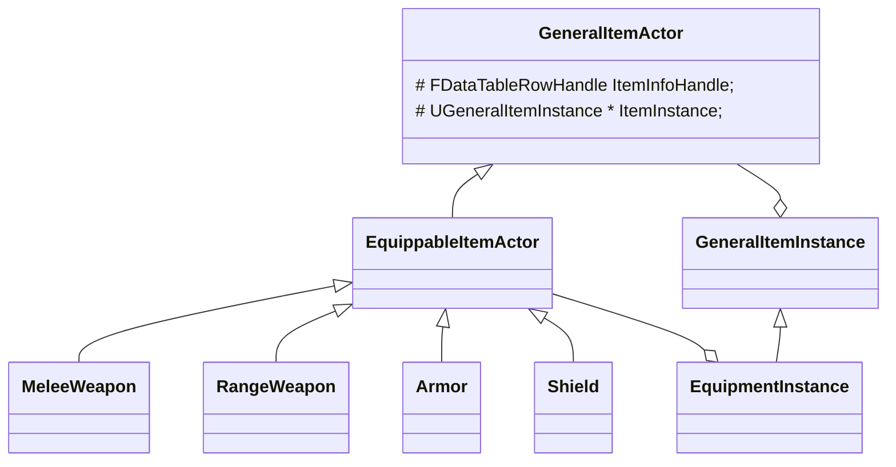
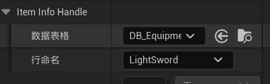
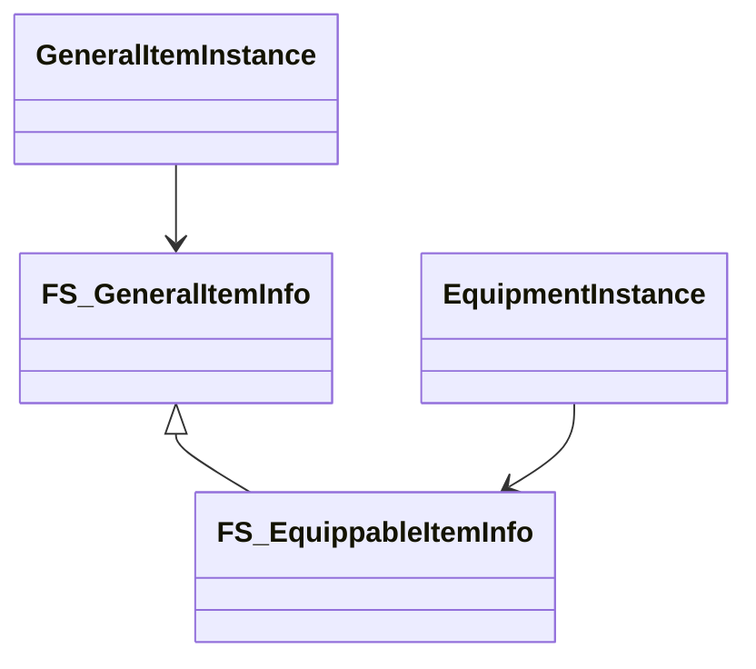
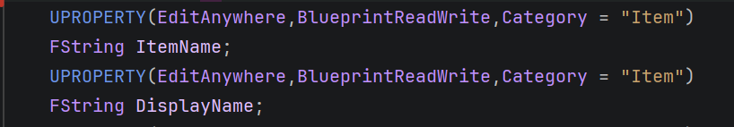

## Item：可拾取道具设计框架

## 一、类图与继承逻辑

### 1.1 关于Item类



我做一些简单的说明：

1. 图上的类图其实没画完，如图所示的四个装备种类，都有静态网格体版本和骨骼网格体版本两个类型，其互动逻辑和组件构成不一样，自然也要区分两个类型，也就是说最后的可实例化的`EquippableItemActor`的子类有八个，图中的四个子类都是抽象类，真正网格体组件（无论是静态还是骨骼）都是在这个四个子类的子类中包含的成员。

2. 真正包含道具信息的是`Instance`这一继承体系，因为当你拾取道具之后，道具应该从世界中消失，也就是说道具的`Actor`应该被销毁，但是这个销毁的道具怎么加入背包呢？

   实现的办法就是在道具内部保留一个`Instance`指针，这里保存真正的道具信息，当道具被拾取之后，把世界的道具销毁并把`Instance`的指针Copy到背包，最后将指向`Instance`的指针置空，这样就实现了一个“金蝉脱壳”。

3. 如类图所示，目前图上整个继承体系其实只有两个变量，也就是`GeneralItemActor`里面的了两个。其中`ItemInstance`在`GeneralItemActor`实例里面指向了一个`GeneralItemInstance`实例，在`EquippableItemActor`实例里面指向了一个`EquippmentInstance`实例。方法我没有写，因为都是一些初始化和Getter，没有什么特别需要注意的。

   那为什么只有这两个成员我还要设计的这么复杂呢？因为这样做有利于日后开发的弹性和兼容，严格来说`GeneralItemActor`它就是一个可拾取物品，`EquippableItem`就是一个装备，这是两个不同的东西，日后难免会加入不同的逻辑，其他的同理。


### 1.2 关于数据的组织

所有的被创建的Item实例，都必须指定一个数据表格行作为它的数据来源，这也是它唯一可以在蓝图中编辑的内容，如下：



网格体组件名义上可以编辑，但是只是为了确认视觉效果的预览而已，实际运行的时候还是会根据数据表格指定的网格体来设置。当然，你在这里设置的大小，位置，旋转以及碰撞预设，引擎会帮你Copy好，这也是为什么我把网格体设置为可编辑的原因，为了调整视觉上的效果。

所以这一小节的重点在于数据的组织方式，数据表格的数据被读入，又是如何被组织到每一个Item里的，背包里面保存的又是那些数据？

类图如下：



具体的成员有哪些我就不展开写了，只需要知道`FS_GeneralItemInfo`是作为`GeneralItemInstance`的数据来源，在`GeneralItemActor`被初始化时，如果`ItemInstance`为空，便会从预设的数据表格行读入并创建`GeneralInstance`作为`ItemInstance`所指的对象。

`FS_EquippableItemInfo`以及`EquipmentInstance`和`EquippItemActor`的关系类似，区别在于`FS_EquippableItemInfo`多了一些装备特有的属性成员。


## 二、关于背包的放入和取出

严格来说我目前没有实现背包，只是实现了一个"只能装装备的装备背包"，这也是难免的，因为目前的开发进度并没有除了装备以外任何可拾取物品真正的实例。

### 2.1 放入过程

1. 玩家对着Item按下拾取按键，检测到Item，调用`BPC_Equipment`的`AddEquipment`函数
2. 将Item的`ItemInstance`加入背包，并初始化相关查找结构。
3. 销毁被拾取的`Actor`


### 2.2 取出/装备武器过程

1. 查找玩家指定的物品是否存在在当前背包，如果存在进入下一步；否则报错返回
2. 进行一系列检查（不细说）之后，根据`Instance`中的网格体类型生成相应`Actor`。注意这次生成并没有新建新的`ItemInstance`，只是把背包里面的指针Copy了一份过去给这个Actor。
3. 若是静态网格体，需要根据`Instance`中指定的`SocketName`来进行位置挂载。
4. 骨骼网格体需要额外单独处理，具体情况具体分析，这里不细说。
5. 根据需要设置生成的`Actor`碰撞，一般盔甲的话需要和角色网格体的设置一致，武器的话设置成无碰撞。总之，我都在预设里面写好了设置，武器设置为`EquippedWeapon"`，盔甲一般不用设置，因为你的角色网格体并没消失，只是隐藏了，角色网格体的碰撞还在生效。


## 三、关于背包的查找逻辑

### 3.1 `GeneralItemInfo`中的变量与背包查找的key

`FS_GeneralItemInfo`中有如下两个变量：



其中`DisplayName`是作为你在游戏UI里面显示的名字，`ItemName`是背包内部的查找的key。

### 3.2 背包中关于可堆叠物品与不可堆叠物品的处理

什么是可堆叠物品呢？就是金币之类的，你不用保存它的每个实体，只需要保存一个实体，然后写一个数量就好了。

但是有些东西，比如攻击力不同但是名字相同的装备，这种情况在装备经过强化以后很常见，你这必须生成两个实体，即便他们在背包中的`ItemName`和`DiaplayName`都一样。

这个设置是在`FS_GeneralItemInfo`的`CanBeStacked`实现的，同样可以在数据表格编辑。

我之前说过，背包是根据`ItemName`为key来查找物品的，那么对于同名的不可堆叠对象该怎么处理呢？其实背包内部有两个变量：

```c++
//作为真正保存Item的背包
TArray<UEquipmentInstance*> EquippableItems;
//仅在C++内部可见，用来加快查找
TMap<FString,UEquipmentInstance*> EquipmentName2Obj;
```

当你在`EquipmentName2Obj`查找到你要添加/删除的Item之后：

- 如果Item不可堆叠，背包会乖乖在数据中遍历，根据内存地址判断到底哪个是你要操作的Item
- 如果Item可堆叠，背包直接修改这个Item的数量即可

所以说，不可堆叠Item在Map里面保存了哪个不重要，只要背包检测到这个对象不可堆叠，他就会乖乖去遍历整个数组。


