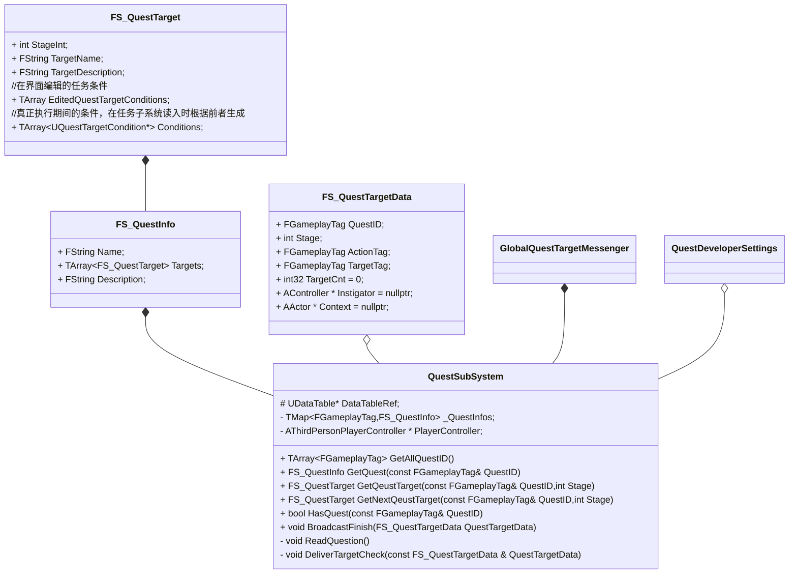
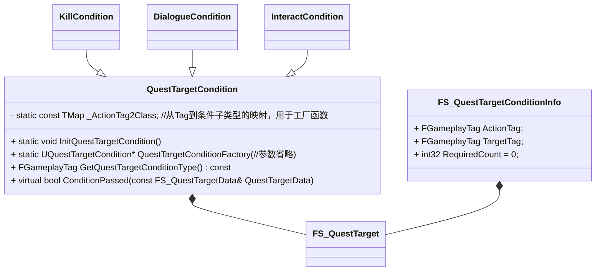
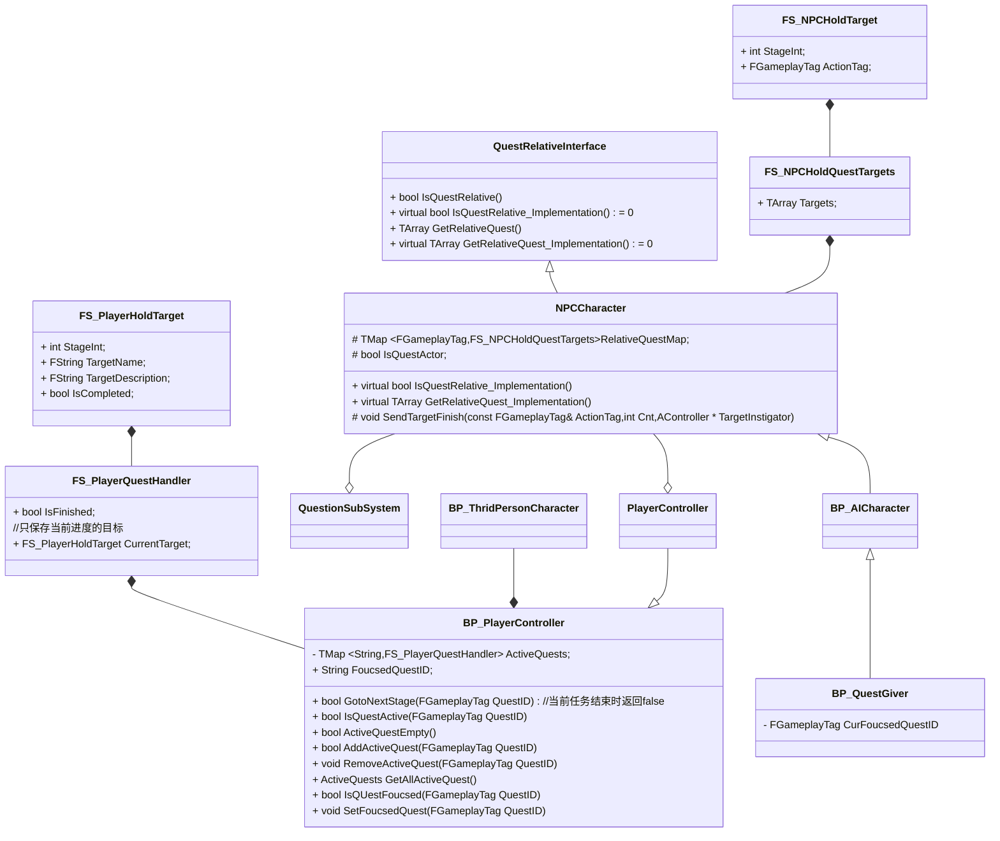
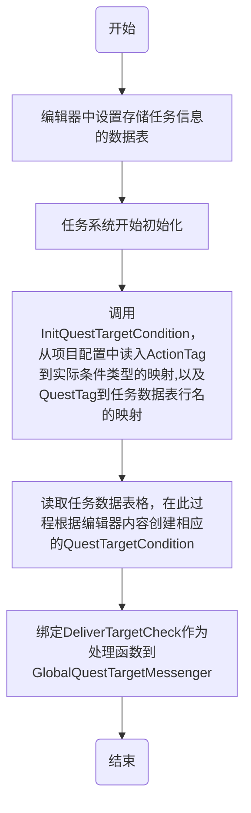
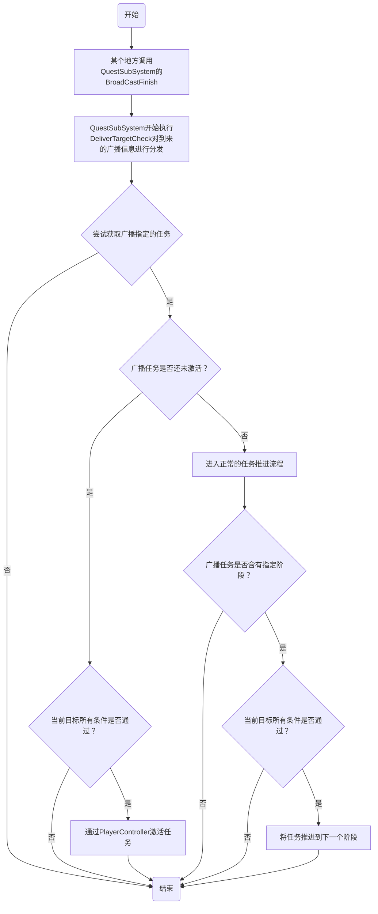

# 任务系统

## 一、类图

### 3.1 任务子系统

`QuestTarget`的组织如下：

说明：

1. `QuestTargetCondition`作为纯虚基类而存在，其他目标完成条件都是它的子类
2. `FS_QuestTargetConditionInfo`是你在编辑器真正编辑的东西，在任务初始化阶段会被创建成任务条件加入任务目标数据中，之所以这么做是因为`QuestTargetCondition`受限于多态等原因必须是一个指针，而编辑器无法编辑指针。
3. `FS_QuestTargetData`唯一的作用是作为`GlobalQuestTargetMessenger`的传递参数
4. `BroadcastFinish`其实是封装了`GlobalQuestTargetMessenger`的调用，你当然可以用后者进行某个目标条件完成的广播，但是封装在任务子系统里面显得逻辑更清楚一些。
5. `QuestDevelperSettings`是编辑器中可填入的全局设置，包括`FGameplayTag`到实际`QuestTargetCondition`子类的映射，以及编辑器中的编辑的任务Tag到任务数据表格的行名的映射

### 3.2  玩家和NPC持有的任务

说明：

1. 从类图也可以看出，玩家和任务NPC并不持有任务数据，只有任务ID以及自己当前所处阶段的信息，真正的任务数据都在任务子系统里面，玩家和NPC需要时利用ID和Stage去查询即可

2. 任务进度是保存在`PlayerController`里面的，这也就意味着推进任务必须从`PlayerControler`入手，就实际情况来讲，`GotoNextStage`是目前唯一的推进任务进度的手段。

3. 关于任务的Stage，一般来说设置是：

   - 未开始/玩家未接取为0
   - 接取后为100
   - 之后每个阶段都增加100

   如果中途还想要增加阶段，可以从两个阶段例如100~200之间取一个数字作为中间阶段，没有必须要修改其他目标元素。

4. `QuestRelativeInterface`是用来判断当前Actor是否是任务相关的接口，里面还有一些附带的获取Actor任务的函数

5. 物品也就是`QuestRelativeItem`的设计和`NPCCharacter`中有关任务系统的设计完全一致，就只是把代码Copy过去改了下类名而已，这里就不多赘述了。

## 二、工作流程

### 2.1 任务系统初始化流程

### 2.2 任务完成流程

## 三、相关的数据驱动设置

### 3.1 关于任务激活的两种方式

​	我的设计里面，任务激活是有两者方式的：

1. 如果任务的`Stage0`也就是未激活阶段里面没有完成条件，那这个任务必须通过和NPC互动，然后弹出任务界面点击接取按钮才能接取。
2. 如果任务的`Stage0`也就是未激活阶段里面有完成条件，那么当完成条件满足时任务就会自动出现在玩家的任务列表里面

### 3.2 如何添加一个新的任务？

1. 到`Content\QuestionSystem`目录下，打开`DB_Quest`，添加你要编辑的任务信息
2. 同一目录下打开`DB_GameplayTag`，添加新行：`Quest.YuorQuestName`，注意行名和行内标签必须一致
3. 顶部菜单寻找编辑，打开：`编辑->项目设置->Quest System Settings`
4. 添加新的`DB_Quest`数据表格行名到Tag的映射
5. 具体的任务信息编辑中，你如果设计了任务完成条件的相关NPC和物品，必须到该NPC和物品的蓝图编辑器进行相关设置任务系统才能识别你的设置，具体操作参考对话系统4.2，唯一区别在于`ActionTag`的设置根据你的设计不同而不同。

### 3.3 如何创建新的任务完成条件类型？

1. 具体的任务完成条件需要在C++派生自`QuestTargetCondition`。
2. 到`Content\QuestionSystem`目录下，打开`DB_GameplayTag`，添加`Quest.Action.YourAction`，注意行名和行内标签必须一致
3. 顶部菜单寻找编辑，打开：`编辑->项目设置->Quest System Settings`
4. 增加新元素到`ConditionMap`，将你添加的`ActionTag`映射到你派生的子类

## 四、补充说明

### 4.1 为什么你的任务系统设计的这么麻烦，尤其是任务完成条件的编辑，既要在任务数据表中设置，还要去相关的Actor蓝图编辑器设置？

这是出于性能考虑，我一开始也试过那种只在任务数据表格设置好完成条件和关联Actor，然后全部交给任务系统的做法。结果是，这样设计的话，你的任务系统是没办法识别向它发出的目标完成广播到底是哪个任务的哪个阶段的，也就是即便你执行一个很小的任务，也要把所有任务的所有阶段过滤一遍，一个挨着一个来看看当前发出的完成条件是否满足。

这无疑对CPU是一种巨大的浪费，而且这样设计很不合理，我目前想到的唯一办法就是把相关任务和阶段在Actor里面存一份，当Actor被实施了某种操作后，它会告诉任务系统自己的任务和阶段是哪里，从而推进任务。

