# 任务系统

## 一、类图

### 1.1 任务子系统

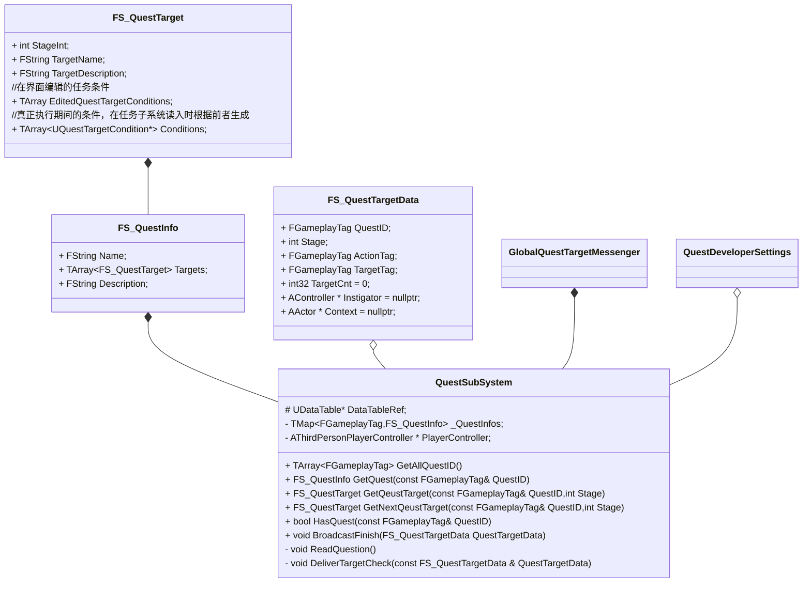

`QuestTarget`的组织如下：

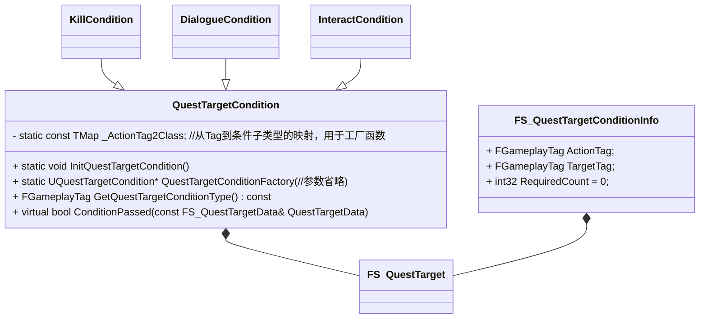

说明：

1. `QuestTargetCondition`作为纯虚基类而存在，其他目标完成条件都是它的子类
2. `FS_QuestTargetConditionInfo`是你在编辑器真正编辑的东西，在任务初始化阶段会被创建成任务条件加入任务目标数据中，之所以这么做是因为`QuestTargetCondition`受限于多态等原因必须是一个指针，而编辑器无法编辑指针。
3. `FS_QuestTargetData`唯一的作用是作为`GlobalQuestTargetMessenger`的传递参数
4. `BroadcastFinish`其实是封装了`GlobalQuestTargetMessenger`的调用，你当然可以用后者进行某个目标条件完成的广播，但是封装在任务子系统里面显得逻辑更清楚一些。
5. `QuestDevelperSettings`是编辑器中可填入的全局设置，包括`FGameplayTag`到实际`QuestTargetCondition`子类的映射，以及编辑器中的编辑的任务Tag到任务数据表格的行名的映射

### 1.2  玩家和NPC持有的任务

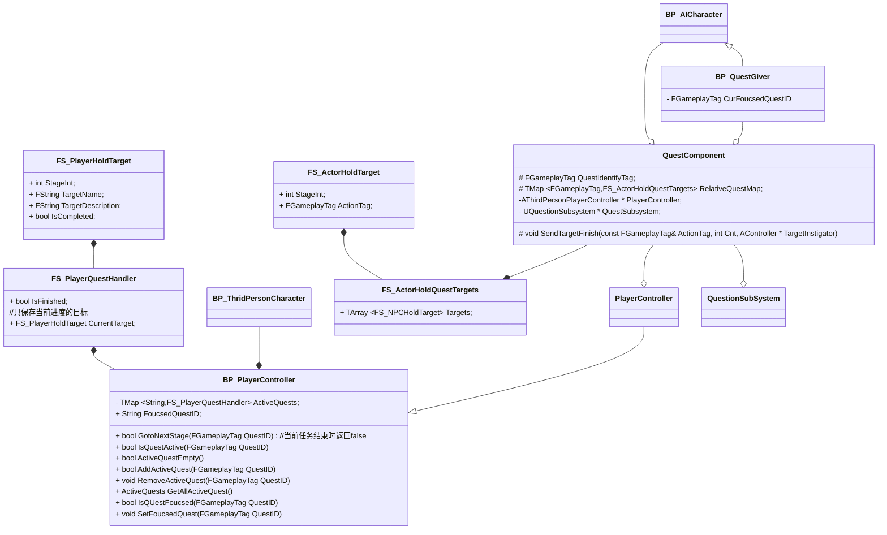

说明：

1. 从类图也可以看出，玩家和任务NPC并不持有任务数据，只有任务ID以及自己当前所处阶段的信息，真正的任务数据都在任务子系统里面，玩家和NPC需要时利用ID和Stage去查询即可

2. 任务进度是保存在`PlayerController`里面的，这也就意味着推进任务必须从`PlayerControler`入手，就实际情况来讲，`GotoNextStage`是目前唯一的推进任务进度的手段。

3. 并不是每个NPC都含有`QuestComponent`，只有这个组件代码虽然是C++编写的，但是实际只在编辑器的任务相关实例中添加，也就是说**`QuestComponent`不是某个类的成员，它是实例相关而不是类相关**。

4. 关于任务的Stage，一般来说设置是：

   - 未开始/玩家未接取为0
   - 接取后为100
   - 之后每个阶段都增加100

   如果中途还想要增加阶段，可以从两个阶段例如100~200之间取一个数字作为中间阶段，没有必须要修改其他目标元素。

5. 物品也就是`QuestRelativeItem`的设计和`NPCCharacter`中有关任务系统的设计完全一致，就只是把代码Copy过去改了下类名而已，这里就不多赘述了。

## 二、工作流程

### 2.1 任务系统初始化流程

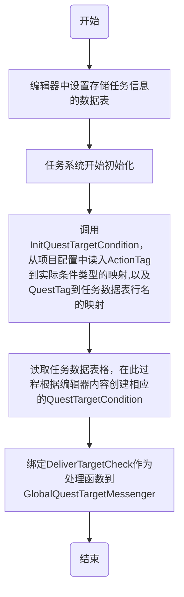

### 2.2 任务完成流程

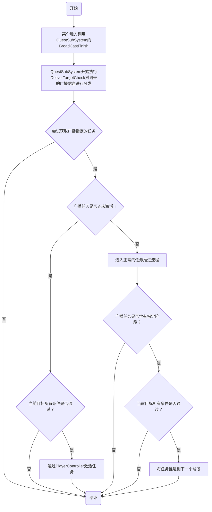

## 三、相关的数据驱动设置

### 3.1 关于任务激活的两种方式

​	我的设计里面，任务激活是有两者方式的：

1. 如果任务的`Stage0`也就是未激活阶段里面没有完成条件，那这个任务必须通过和NPC互动，然后弹出任务界面点击接取按钮才能接取。
2. 如果任务的`Stage0`也就是未激活阶段里面有完成条件，那么当完成条件满足时任务就会自动出现在玩家的任务列表里面

### 3.2 如何添加一个新的任务？

#### 3.2.1 到`Content\QuestionSystem`目录下，打开`DB_Quest`，添加你要编辑的任务信息，当你添加一行以后基本的面板如下：

#### 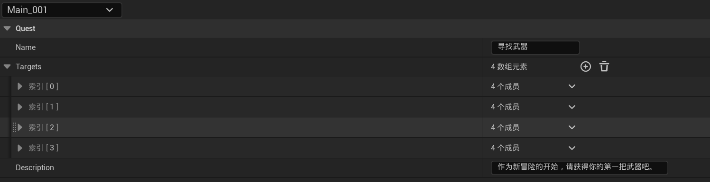

我进行一些说明：

1. **`Name`**这一栏不是程序内部使用的，程序内部使用的是你的`QuestTag`到数据表行名的映射，这个`Name`是作为你在**游戏UI中显示的文本**使用的
2. `Targets`是一个任务目标（阶段）数组，一个任务不可能只有一个目标，所以这是一个数组，展开后它的一个成员如下：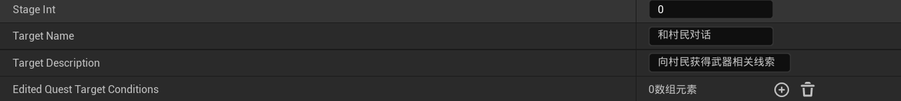

- `StageInt`：用来在任务内确定阶段的标识符，它的大小也代表了任务目标的先后（注意这个先后不是按照数组元素的先后，而是`StageInt`越小，在任务中这个目标越靠前），`StageInt`**必须大于0**，因为默认任务未接取阶段为0，如果不为0任务系统无法查找到该任务的接取阶段，导致**任务无法接取**

- `TargetName`和`TargetDescription`作为游戏内UI显示的目标名字和目标描述

- `Edited Quest Target Conditions`：目标达成所需的条件，达成数组中所有条件以后，任务系统自动将目标推进到下一个阶段，它的一个成员构成如下：

  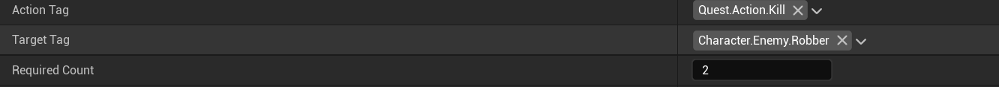

  1. `ActionTag`：条件完成要执行的动作
  2. `TargetTag`：对谁执行该动作，可以是任何添加了`QuestComponent`的角色和物品，这个`Tag`如何确定，如何填写，细看**3.4关于`QuestComponent`的说明**
  3. `RequiredCount`：要求的数量，如果是对话或者互动，你填不填都行，因为肯定只有一次，任务系统也不看你写的几次，但如果是击杀条件，就必须写你想要杀几个才达成条件

#### 3.2.2 添加数据表行名到任务Tag的映射

1. 同一目录下打开`DB_GameplayTag`，添加新行：`Quest.YuorQuestName`，注意行名和行内标签必须一致
2. 顶部菜单寻找编辑，打开：`编辑->项目设置->Quest System Settings`
3. 添加新的`DB_Quest`数据表格行名到Tag的映射

为什么要做这一步呢？因为任务系统内部识别任务使用的`GameplayTag`，而为了让数据表格的行和Tag对应起来我选择了这么一种做法，虽然可以根据任务名字（数据表的行名），让任务系统自行生成并添加Tag，但我感觉还是把这个逻辑交给编辑器更合适，因为数据表行名的命名相对`GameplayTag`要自由得多，甚至可能为中文这种程序中最好不要出现的字符

### 3.3 如何创建新的任务完成条件类型？

1. 具体的任务完成条件需要在C++派生自`QuestTargetCondition`。
2. 到`Content\QuestionSystem`目录下，打开`DB_GameplayTag`，添加`Quest.Action.YourAction`，注意行名和行内标签必须一致
3. 顶部菜单寻找编辑，打开：`编辑->项目设置->Quest System Settings`
4. 增加新元素到`ConditionMap`，将你添加的`ActionTag`映射到你派生的子类

### 3.4 关于`QuestComponent`的说明

#### 3.4.1 `QuestComponent`有什么用

正如之前所说，除了玩家外，所有的NPC和物品必须要有这个组件并进行相关设置，才能被**任务系统识别**，（准确来说是自己拥有了能够和任务系统沟通的能力，把自己的信息push到任务系统，不过从用户角度来讲这个不重要）。

关键的一点在于，你不要在蓝图类里面添加这个组件，而是在创建好的单个实例里面。因为与任务关联的`Actor`非常少，你在一整个类里面添加组件会让很多这个类的实例带有冗余信息，造成资源的极大浪费

#### 3.4.2 添加`QuestComponent`到单个实例

1. 在视口中点击任意一个Actor，选中，在编辑器右侧细节面板中点击添加：

   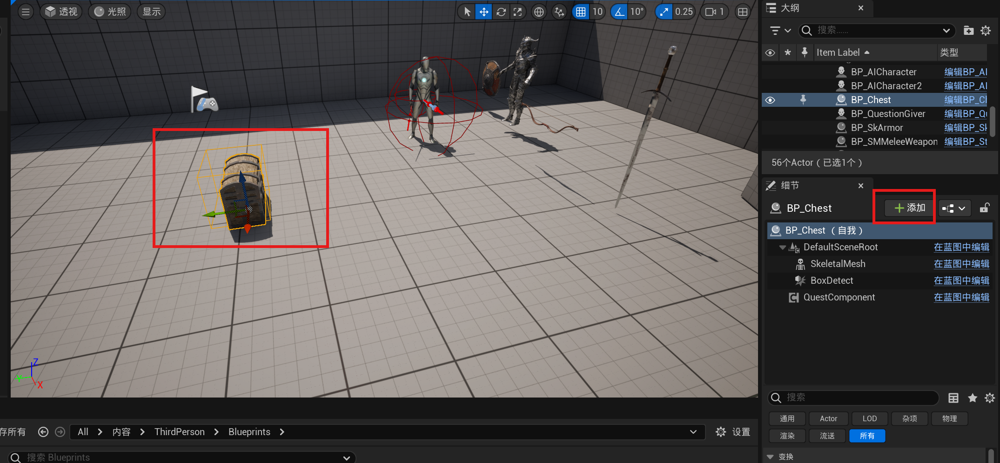

2. 选择`Quest`并添加

   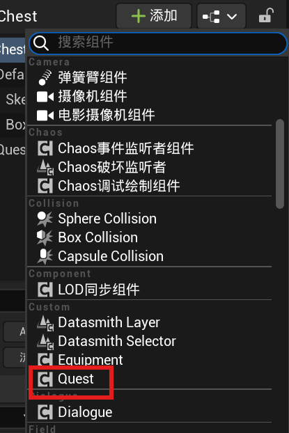

#### 3.4.3 设置`QuestComponent`

点击添加好的`Quest`，在下方细节面板可以看到`Quest`标签下的两个关键变量：

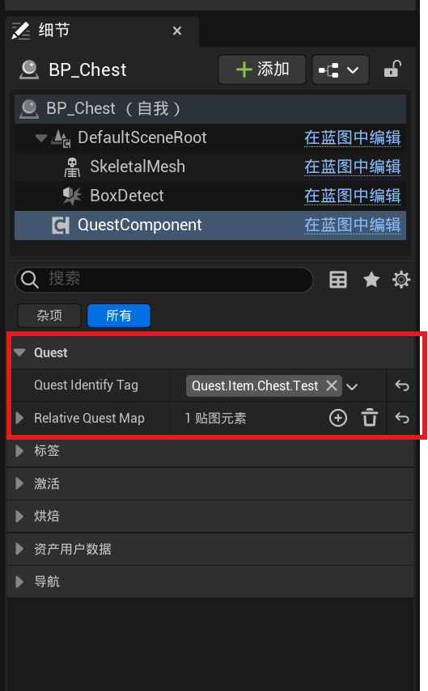

这两个变量就是Actor持有的所有任务信息，这里我已经设置好了，你的面板应该是`None`和`0个贴图元素`。接下来我说明下这两个变量如何设置

1. `Quest Identify Tag`：这个变量是用来标识这个Actor供任务系统识别的，你如果在任务条件信息编辑，也就是**`3.2.1`的第二步中设置了任务的完成条件**，那么那里的**`TargetTag`**就是按照这个变量填，两个地方必须**一致**，只有一样任务系统才能识别出你在任务条件中说得是这个Actor。这也是为什么我要坚持用Tag的原因，因为交给字符串太容易在编辑时出错还不好查这个BUG。

   如果你是**角色**的话，当你添加了任务组件以后，若是你**没填写**这个变量，运行时这个组件会**自动读取角色的`CharacterTag`**来设置**默认值**。这个设计是为了兼容对话系统，毕竟对话系统也是用`CharacterTag`来识别角色的，你要是两个地方设置的不一样，目前来讲没问题，因为对话组件和任务系统的交流独立于任务组件，但之后的开发保不准会出问题。

   所以说，对于**角色**你最好**不要设置`Quest Identify Tag`**。留给任务系统自行处理填入默认值就好。

2. `Relative Quest Map`：如名字所示，这是一个映射，它实现了从**`QuestTag`**到**持有此组件的Actor与`QuestTag`指定的任务的哪些阶段有关的映射**。虽然这个句子很长，但是我想不难理解，就是说你让这个`Actor`在哪个任务的哪些阶段发挥作用，这你总得告诉Actor吧。由于一个`Actor`在一个任务中可能在很多阶段都会出现，所以每个映射的值都是一个数组，而键是用来确定任务的Tag。

   每一个值的一个数组元素由以下两个变量构成：

   - `StageInt`：用来指定任务的阶段，之前在3.2.1节就说过，这个变量是任务内部阶段的标识符。
   - `ActorTag`：当玩家对这个`Actor`执行了什么动作才算完成条件？

细心的人一定会发现，在任务组件设置的信息好像和任务数据表格里面重复了，明明那里已经设置了`StageInt`,`ActionTag`以及`TargetTag`，为什么这里再来一次呢？请看4.1，有着详细说明。

## 四、补充说明

### 4.1 为什么你的任务系统设计的这么麻烦，尤其是任务完成条件的编辑，既要在任务数据表中设置，还要去相关的Actor编辑器设置？

这是出于性能考虑，我一开始也试过那种只在任务数据表格设置好完成条件和关联Actor，然后全部交给任务系统的做法。结果是，这样设计的话，你的任务系统是没办法识别向它发出的目标完成广播的到底是哪个任务的哪个阶段的，毕竟你发来的广播信息是：

**玩家对目标A实行了动作B。**

这里面压根没有这个目标A到底是哪个任务的，也就是即便你执行一个很小的任务，也要把所有任务的所有阶段过滤一遍，一个挨着一个来看看这些阶段的每一个条件到底有没有目标A，从而判断当前发出的完成条件是否满足。

这无疑对CPU是一种巨大的浪费，而且这样设计很不合理，我目前想到的唯一办法就是把相关任务和阶段在Actor里面存一份，当Actor被实施了某种操作后，它会告诉任务系统自己的任务和阶段是哪里，从而推进任务。

### 4.2 关于谁能广播任务条件完成（调用`BroadcastFinish`）

就目前来讲，能够进行这个动作的有两个组件：

1. `Dialogue Component`
2. `Quest Component`

对于对话完成以后其实不是从`QuestComponent`广播的，因为对话资产就有它对应的任务和阶段，这也符合实际，因为你的对话一般来说不会重复，一个任务一个阶段对应一个，不该是完成了和某人的对话就直接推进了所有符合这个条件的阶段，还要看到底是哪个对话。

但是如果是击杀和互动之类的动作，当多个任务都要你杀死三个强盗时，你杀了三个强盗就应该是完成了要求这个条件的所有任务和所有阶段。

也就是说，对话引起的任务进度推进要三个维度：任务，阶段，以及对话本身，仅凭在任务数据表编辑任务和阶段无法推进，我的设计其实是把这三个维度隐藏在了对话资产内，本身你创建对话资产时就已经有了一个维度，剩下两个维度要你自己填写。

