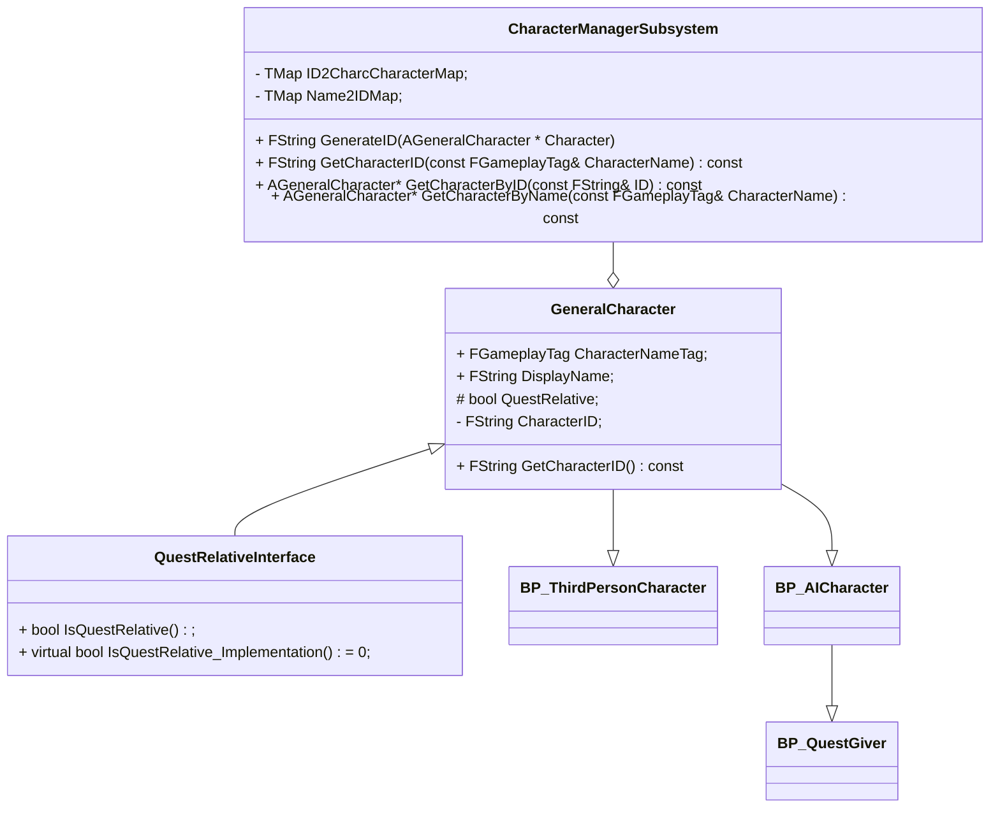
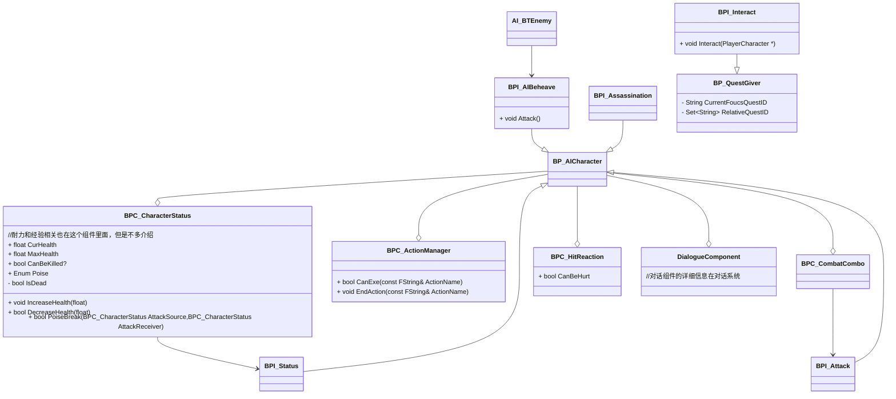
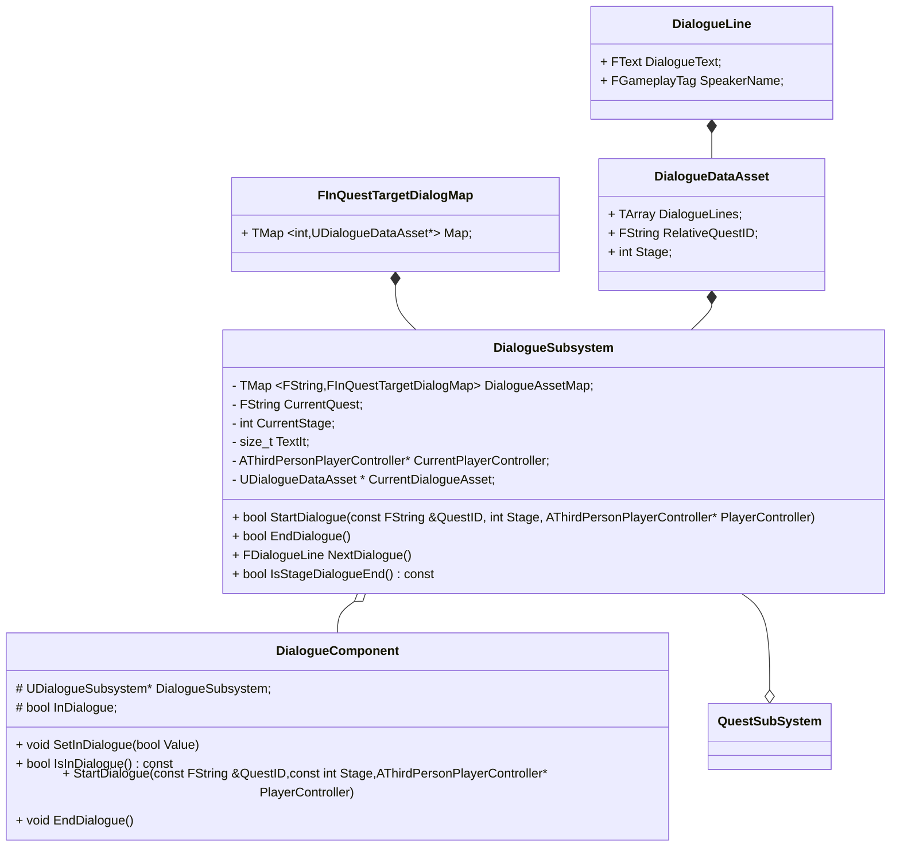
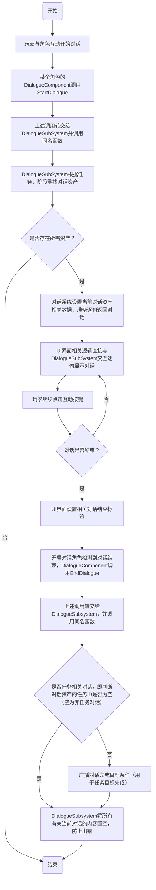
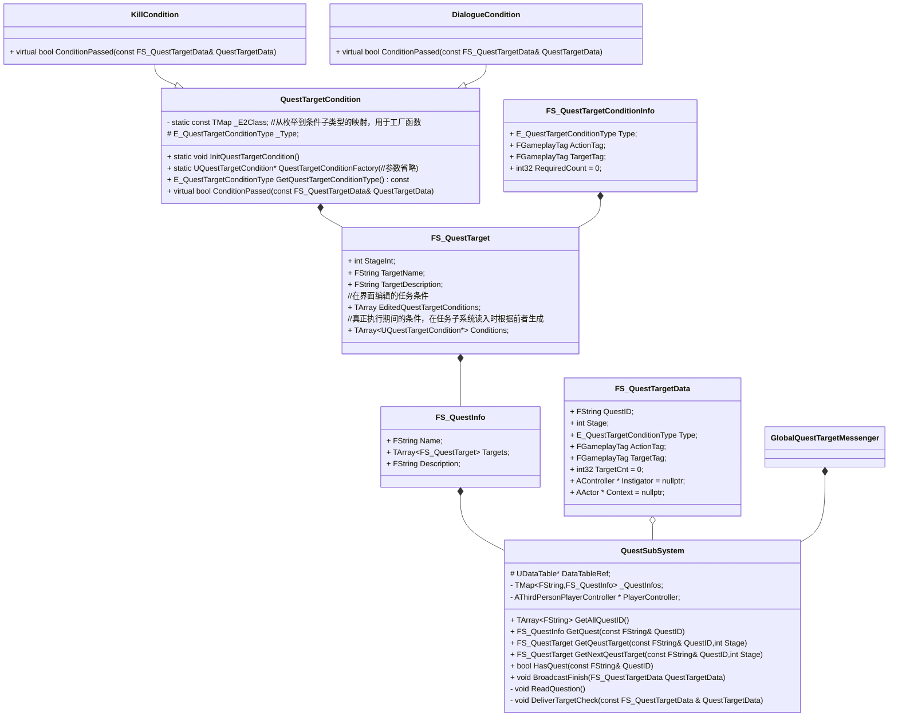
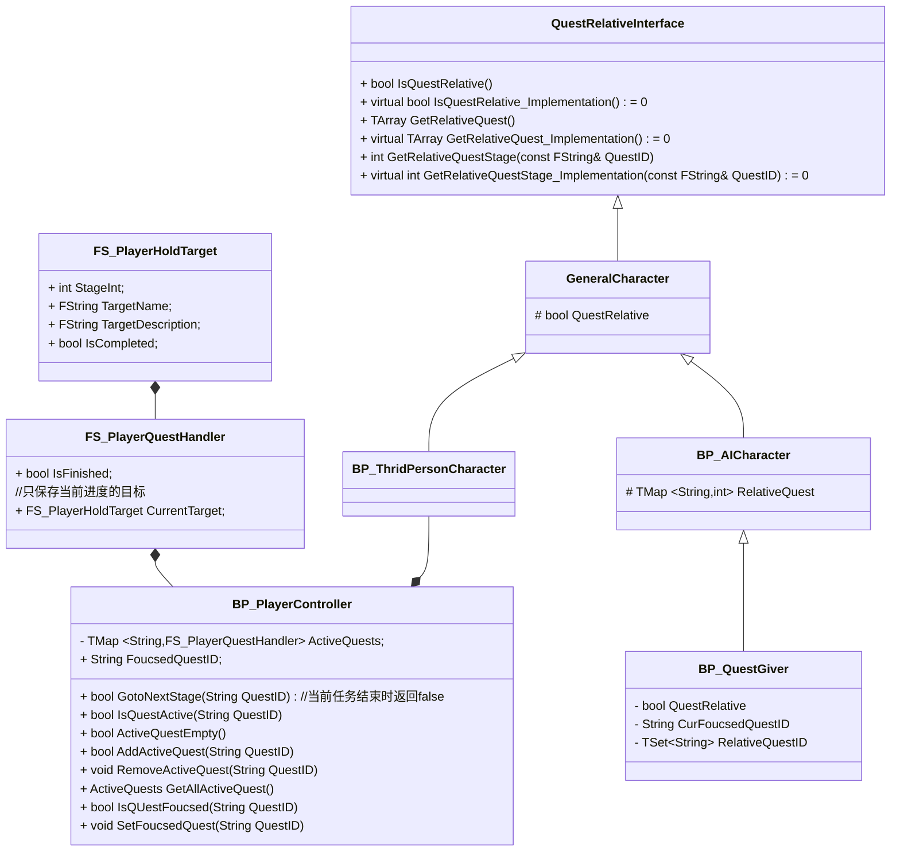
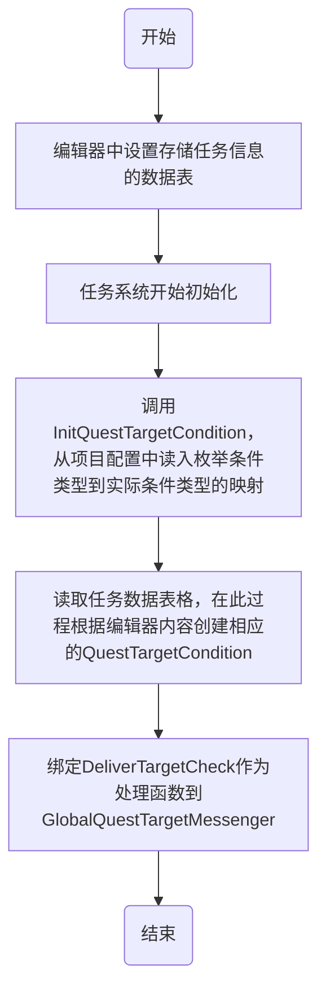
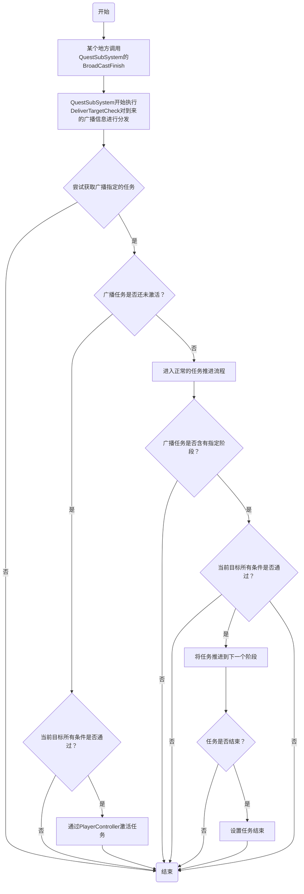

# 任务系统，对话系统，以及角色系统文档整理

## 一、角色系统

### 1.1 角色管理系统以及NPC

角色管理系统和角色继承逻辑的基本类图如下：

NPC的角色功能设计如下：

做一些简单的说明：

1. 所有角色类继承自`GeneralCharacter`，这里有ID和名字以及显示名字这些基本属性，用于角色管理系统的管理和查询
2. `QuestRelativeInterface`是用来检测当前Actor是否和任务相关的接口，这个接口实际内容看任务系统介绍，而且不光角色类，所有的物品类也要实现它
3. `AICharacter`这个类实际上NPC角色基类，血条，暗杀，攻击都在这里面。`QuestGiver`是一个特殊的能发放任务的友方NPC。
4. `ThridPersonCharacter`就是和`AICharacter`类似，是玩家角色的基类里面有特别多的组件和功能，但是这里不多说了。

## 二、对话系统

### 2.1 类图

解释如下：

1. 真正的数据驱动实现在对话资产里面，编辑器里面也是操作对话资产
2. 对话组件本身是对对话子系统的封装，为了让单个角色对话启动时逻辑更清晰。
3. 对话组件不能有下一句这个功能，因为对话系统本身是集中式的设计，下一句不定是组件的Owner，他获取了属于其他人的对话逻辑上不正确。
4. 任务子系统唯一的耦合点在于广播对话完成这一任务目标完成条件

### 2.2 对话系统初始化以及对话资产读取入流程

```mermaid
flowchart
Start(开始)-->Edit[在编辑器中创建并完成对话资产的编辑]
Edit-->ReadDialogue[DialogueSubSystem读入所有对话资产]
ReadDialogue-->Classify[对所有对话资产按照任务，阶段添加到DialogueAssetMap]
Classify-->End[结束]
```

### 2.3 对话进行流程

## 三、任务系统

### 3.1 类图

#### 3.1.1 任务子系统

说明：

1. `QuestTargetCondition`作为纯虚基类而存在，其他目标完成条件都是它的子类
2. `FS_QuestTargetConditionInfo`是你在编辑器真正编辑的东西，在任务初始化阶段会被创建成任务条件加入任务目标数据中，之所以这么做是因为`QuestTargetCondition`受限于多态等原因必须是一个指针，而编辑器无法编辑指针。
3. `FS_QuestTargetData`唯一的作用是作为`GlobalQuestTargetMessenger`的传递参数
4. `BroadcastFinish`其实是封装了`GlobalQuestTargetMessenger`的调用，你当然可以用后者进行某个目标条件完成的广播，但是封装在任务子系统里面显得逻辑更清楚一些。

#### 3.1.2 玩家和NPC持有的任务

说明：

1. 从类图也可以看出，玩家和任务NPC并不持有任务数据，只有任务ID以及自己当前所处阶段的信息，真正的任务数据都在任务子系统里面，玩家和NPC需要时利用ID和Stage去查询即可

2. 任务进度是保存在`PlayerController`里面的，这也就意味着推进任务必须从`PlayerControler`入手，就实际情况来讲，`GotoNextStage`是目前唯一的推进任务进度的手段。

3. 关于任务的Stage，一般来说设置是：

   - 未开始/玩家未接取为0
   - 接取后为100
   - 之后每个阶段都增加100

   如果中途还想要增加阶段，可以从两个阶段例如100~200之间取一个数字作为中间阶段，没有必须要修改其他目标元素。
   
4. `QuestRelativeInterface`是用来判断当前Actor是否是任务相关的接口，里面还有一些附带的获取Actor任务的函数

### 3.2 任务系统初始化流程

### 3.3 任务完成流程

### 3.4 关于任务激活的两种方式

​	我的设计里面，任务激活是有两者方式的：

1. 如果任务的`Stage0`也就是未激活阶段里面没有完成条件，那这个任务必须通过和NPC互动，然后弹出任务界面点击接取按钮才能接取。
2. 如果任务的`Stage0`也就是未激活阶段里面有完成条件，那么当完成条件满足时任务就会自动出现在玩家的任务列表里面

