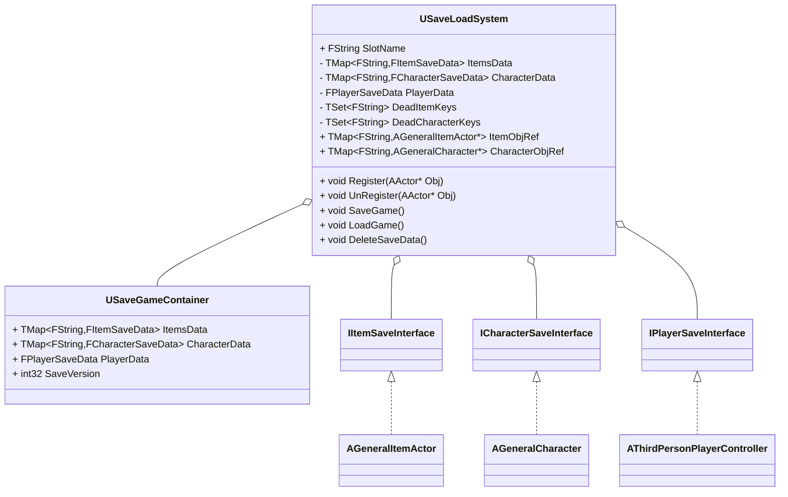
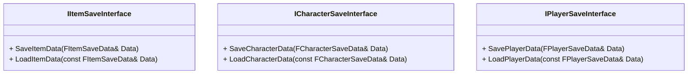
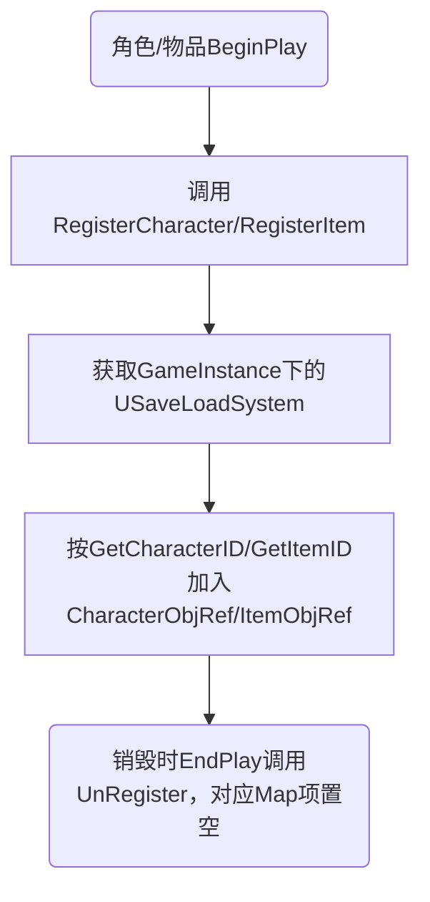
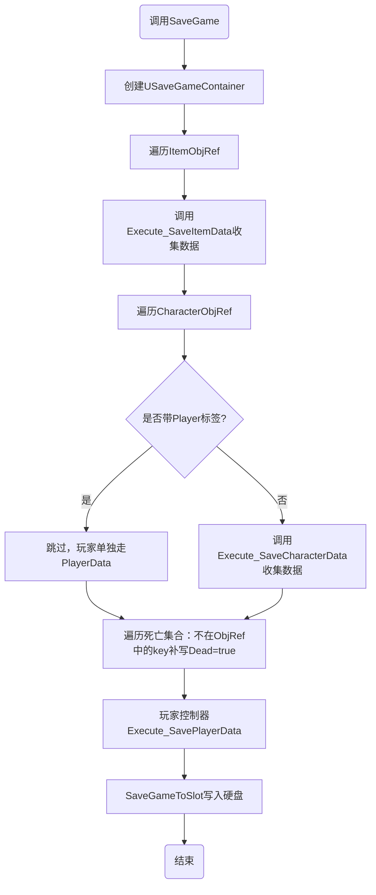
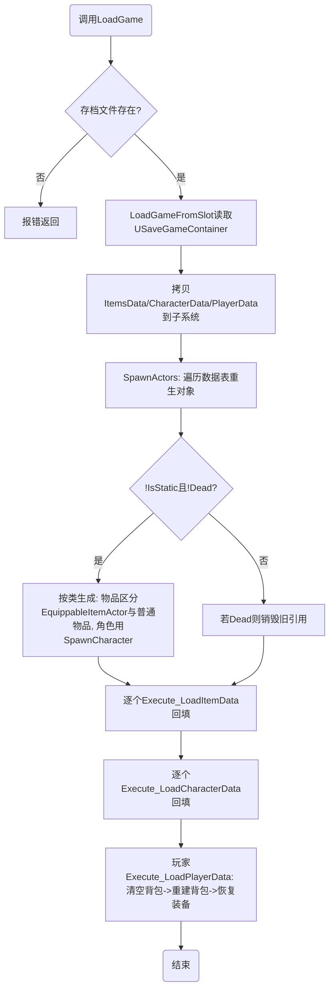

# 存档系统

## 一、概述

存档系统以`USaveLoadSystem`（`UGameInstanceSubsystem`）为总入口，以`USaveGameContainer`（`USaveGame`）为序列化到硬盘的容器。

角色与物品 Actor 无需手动接入：`AGeneralCharacter`与`AGeneralItemActor`在`BeginPlay`时自动注册到存档子系统，销毁（`EndPlay`）时自动注销。存档时系统遍历所有已注册对象，通过存档接口取出数据写入容器；读档时根据记录的数据（位置、类、生死标记等）重新生成运行时对象并回填数据。

核心类图如下：

## 二、数据成员及其说明

所有存档数据结构定义在`SaveData.h`中，均为`BlueprintType`结构体，可在蓝图读写。

### 2.1 `FActorSaveData`（Actor 基础数据，所有存档数据的基类）

| 成员 | 类型 | 说明 |
| :--- | :--- | :--- |
| `Location` | `FVector` | 世界位置，默认零向量 |
| `Rotation` | `FRotator` | 世界旋转 |
| `Scale` | `FVector` | 缩放，默认 1 |
| `Dead` | `bool` | 是否已死亡/被销毁；读档时 `Dead=true` 的对象不会重生（写入规则见 3.2 的死亡集合） |
| `IsStatic` | `bool` | 是否关卡静态摆放（非运行时生成） |
| `Name` | `FString` | 对象名字（调试/日志用） |

### 2.2 `FItemSaveData`（继承`FActorSaveData`）

| 成员 | 类型 | 说明 |
| :--- | :--- | :--- |
| `ItemInfoRowHandler` | `FDataTableRowHandle` | 物品数据表格行引用，用于重建`ItemInstance` |
| `ItemClass` | `TSubclassOf<AGeneralItemActor>` | 物品 Actor 类，读档重生时使用 |

### 2.3 `FCharacterSaveData`（继承`FActorSaveData`）

| 成员 | 类型 | 说明 |
| :--- | :--- | :--- |
| `EquipStatus` | `FS_DefaultEquipmentStatus` | 当前穿戴装备（近战/远程/盾/甲各自的数据表行引用） |
| `Health` | `float` | 当前生命值 |
| `MaxHealth` | `float` | 最大生命值 |
| `MaxStamina` | `float` | 最大耐力值 |
| `Level` | `int32` | 等级 |
| `CanBeKilled` | `bool` | 是否可被击杀 |
| `Faction` | `ECharacterFaction` | 阵营 |
| `CharacterClass` | `TSubclassOf<AGeneralCharacter>` | 角色类，读档重生时使用 |

### 2.4 `FBagItemData`（背包格子）

| 成员 | 类型 | 说明 |
| :--- | :--- | :--- |
| `ItemInfoRowHandler` | `FDataTableRowHandle` | 物品数据表格行引用 |
| `ItemClass` | `TSubclassOf<AGeneralItemActor>` | 物品 Actor 类 |

### 2.5 `FPlayerSaveData`（继承`FCharacterSaveData`）

| 成员 | 类型 | 说明 |
| :--- | :--- | :--- |
| `Equipments` | `TArray<FBagItemData>` | 玩家背包内全部装备 |
| `QuestData` | `FQuestSaveData` | 玩家任务进度（见 2.6） |

### 2.6 `FQuestSaveData`（任务进度）

| 成员 | 类型 | 说明 |
| :--- | :--- | :--- |
| `ActiveQuests` | `TMap<FGameplayTag, FS_PlayerQuestHandler>` | 当前进行中的任务及其当前目标 |
| `FocusedQuest` | `FGameplayTag` | 当前聚焦任务 |
| `ConditionProgress` | `TMap<FGameplayTag, FS_QuestStagesProgress>` | 各任务各阶段的条件剩余数 |

辅助结构：

| 成员 | 类型 | 说明 |
| :--- | :--- | :--- |
| `FS_QuestConditionProgress::StageInt` | `int32` | 阶段标识 |
| `FS_QuestConditionProgress::ConditionsRemaining` | `TArray<int32>` | 与 `FS_QuestTarget::Conditions` 下标一一对应的剩余数；`-1` 表示该条件无需持久化 |
| `FS_QuestStagesProgress::Stages` | `TArray<FS_QuestConditionProgress>` | 上述结构按阶段组成数组（UHT 不允许 `TMap` 的值直接是 `TArray`，所以包了一层） |

### 2.7 `USaveGameContainer`（存档容器）

继承`USaveGame`，是真正写入硬盘的对象，成员与子系统对应：

| 成员 | 类型 | 说明 |
| :--- | :--- | :--- |
| `ItemsData` | `TMap<FString,FItemSaveData>` | 物品存档表，key 为物品 ID |
| `CharacterData` | `TMap<FString,FCharacterSaveData>` | 角色存档表，key 为角色 ID |
| `PlayerData` | `FPlayerSaveData` | 玩家数据（单独存放，不占用 CharacterData） |
| `SaveVersion` | `int32` | 存档结构版本，当前为 1；读档时 `< 1` 视为旧档并打 Warning |

## 三、接口设计

### 3.1 存档接口（`SaveGameInterface.h`）

三个接口均为`BlueprintNativeEvent`，C++ 提供默认实现，蓝图也可以覆写（`Event`版本）补充自定义数据，例如`CharacterStatus`的生命值、经验等目前就是由蓝图侧通过覆写接口填写的。

- `IItemSaveInterface`：由`AGeneralItemActor`实现。C++ 默认保存/恢复位置、旋转、缩放、数据表行、类、`IsStatic`与`Name`。
- `ICharacterSaveInterface`：由`AGeneralCharacter`实现。C++ 默认保存/恢复穿戴装备（转为`FS_DefaultEquipmentStatus`）、`IsStatic`、`Name`、`CharacterClass`与位置（`Location/Rotation/Scale`）；读档时按数据表行重建装备实例并穿回。装备组件（`UEquipmentComponent`）是**可选依赖**：角色没有它时只跳过装备部分，其余字段照常读写。
- `IPlayerSaveInterface`：由`AThirdPersonPlayerController`实现。C++ 默认保存背包（转成`FBagItemData`数组）、当前装备与任务进度（`QuestData`）；读档时先清空背包再逐件重建并恢复穿戴，并直接覆盖`ActiveQuests/FocusedQuest`、回写各条件的剩余数（不走`AddActiveQuest`，它硬编码了`Quest.Targets[1]`）。

> 蓝图覆写注意：覆写后的实现里若“重建”整个存档结构体（`MakeStruct` 或 Return 节点逐字段回填），**未连线的字段会静默变成默认值**。建议在 parent 返回的结构体上用 `Set Members in Struct` 只改自己那部分字段。同理，结构体新增字段后需同步检查覆写了存档接口的蓝图。

### 3.2 子系统公开接口（`USaveLoadSystem`）

| 函数 | 说明 |
| :--- | :--- |
| `Register(AActor* Obj)` | 注册角色/物品到存档表，按 ID 存入`CharacterObjRef`/`ItemObjRef`。角色与物品在`BeginPlay`中自动调用，一般无需手动调用 |
| `UnRegister(AActor* Obj)` | 注销对象：从 Map 中移除并记入死亡集合（`DeadCharacterKeys` / `DeadItemKeys`），存档时据此写 `Dead=true` |
| `SaveGame()` | 收集所有已注册对象的数据并写入存档槽 |
| `LoadGame()` | 从存档槽读取并重建世界状态 |
| `DeleteSaveData()` | 删除存档槽文件 |
| `SlotName` | 存档槽名，默认`"SaveSlot1"`，可在蓝图修改 |

## 四、工作流程

### 4.1 注册流程

### 4.2 存档流程（`SaveGame`）

### 4.3 读档流程（`LoadGame`）

生成规则细节：

1. 物品：若`ItemClass`是`AEquippableItemActor`子类，用`UEquipmentInstance::EquipmentInstanceFactory`创建实例；否则用`UGeneralItemInstance::GeneralItemInstanceFactory`。随后调用`AGeneralItemActor::SpawnItem`在记录的位置生成。
2. 角色：调用`AGeneralCharacter::SpawnCharacter`生成，`IsStatic`会被置为`false`。
3. `Dead`为`true`的对象不会重生，若其引用仍存在则直接销毁。
4. 生成失败（`SpawnCharacter` / `SpawnItem` 返回空）时**不覆盖**已有映射，仅输出 Warning；否则该 key 会在下一次存档被误写成 `Dead=true`，进而误删仍存活的对象。
5. 回填数据时跳过 `Dead=true` 与空 key 的条目（它们只是死亡记录，没有需要回填的对象）。

### 4.4 删除存档

`DeleteSaveData`调用`UGameplayStatics::DeleteGameInSlot`删除槽文件，失败（文件不存在等）时输出 Warning 日志。

## 五、当前覆盖范围与限制

1. 已覆盖：世界中物品（位置/数据/生死）、NPC 角色（装备/生死/阵营/等级）、玩家背包与当前装备。
2. 未覆盖：对话状态（对话不单独保存，由任务进度与角色的聚焦任务推导）。
3. `Health`、`MaxHealth`等状态字段已在结构体中预留，C++ 默认实现不填写，需要蓝图覆写接口补齐（例如`CharacterStatus`）。
4. 对象 ID（`CharacterID` / `ItemID`）是 **`UPROPERTY`**：`OnConstruction` 只在为空时生成，注册时再兜底一次。关卡里摆放的对象需要在编辑器里保存一次关卡把 ID 固化，之后运行时跨会话保持一致。

## 六、实现要点与注意事项

1. **对象 key 必须是 `UPROPERTY`**：`CharacterID` / `ItemID` 若不是 `UPROPERTY`，就不会随关卡序列化，运行时为空串——所有对象会挤在同一个 key 上互相覆盖（表现为每张存档表只剩一条、对象被误删）。
2. **死亡是一条显式记录**：`UnRegister` 把对象移出注册表并写入死亡集合，`SaveGame` 据此写 `Dead=true`；不要用“映射为空”推断死亡。
3. **生成失败不要覆盖映射**：见 4.3 第 4 条。
4. **蓝图重建结构体的陷阱**：见 3.1 的覆写注意；结构体新增字段后，需同步检查覆写了存档接口的蓝图。
5. **任务进度与任务定义分离**：存档只保存玩家进度（任务 Tag、阶段、条件剩余数）；任务定义仍在数据表里，由`UQuestionSubsystem`在初始化时读入。
