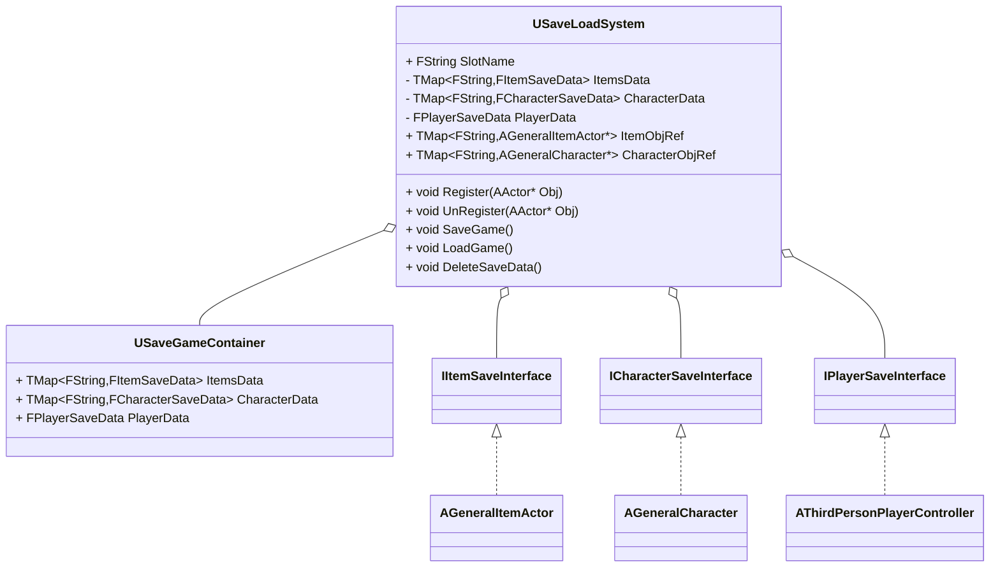
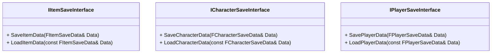
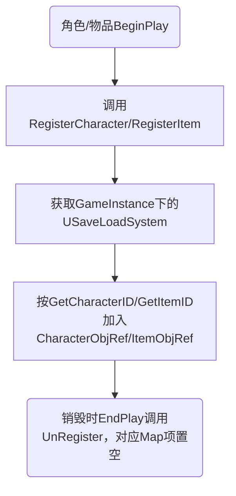
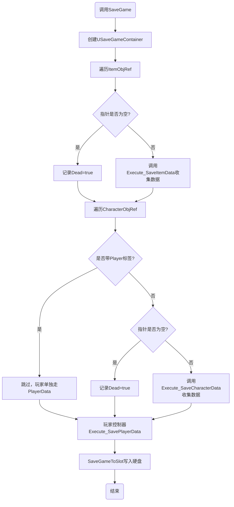
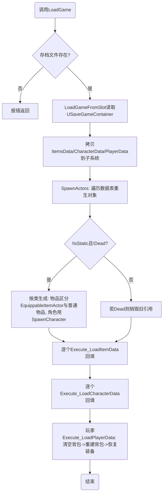

# 存档系统

## 一、概述

存档系统以`USaveLoadSystem`（`UGameInstanceSubsystem`）为总入口，以`USaveGameContainer`（`USaveGame`）为序列化到硬盘的容器。

角色与物品 Actor 无需手动接入：`AGeneralCharacter`与`AGeneralItemActor`在`BeginPlay`时自动注册到存档子系统，销毁（`EndPlay`）时自动注销。存档时系统遍历所有已注册对象，通过存档接口取出数据写入容器；读档时根据记录的数据（位置、类、生死标记等）重新生成运行时对象并回填数据。

核心类图如下：

## 二、数据成员及其说明

所有存档数据结构定义在`SaveData.h`中，均为`BlueprintType`结构体，可在蓝图读写。

### 2.1 `FActorSaveData`（Actor 基础数据，所有存档数据的基类）

| 成员 | 类型 | 说明 |
| :--- | :--- | :--- |
| `Location` | `FVector` | 世界位置，默认零向量 |
| `Rotation` | `FRotator` | 世界旋转 |
| `Scale` | `FVector` | 缩放，默认 1 |
| `Dead` | `bool` | 是否已死亡/销毁，读档时据此决定是否重生 |
| `IsStatic` | `bool` | 是否关卡静态摆放（非运行时生成） |
| `Name` | `FString` | 对象名字（调试/日志用） |

### 2.2 `FItemSaveData`（继承`FActorSaveData`）

| 成员 | 类型 | 说明 |
| :--- | :--- | :--- |
| `ItemInfoRowHandler` | `FDataTableRowHandle` | 物品数据表格行引用，用于重建`ItemInstance` |
| `ItemClass` | `TSubclassOf<AGeneralItemActor>` | 物品 Actor 类，读档重生时使用 |

### 2.3 `FCharacterSaveData`（继承`FActorSaveData`）

| 成员 | 类型 | 说明 |
| :--- | :--- | :--- |
| `EquipStatus` | `FS_DefaultEquipmentStatus` | 当前穿戴装备（近战/远程/盾/甲各自的数据表行引用） |
| `Health` | `float` | 当前生命值 |
| `MaxHealth` | `float` | 最大生命值 |
| `MaxStamina` | `float` | 最大耐力值 |
| `Level` | `int32` | 等级 |
| `CanBeKilled` | `bool` | 是否可被击杀 |
| `Faction` | `ECharacterFaction` | 阵营 |
| `CharacterClass` | `TSubclassOf<AGeneralCharacter>` | 角色类，读档重生时使用 |

### 2.4 `FBagItemData`（背包格子）

| 成员 | 类型 | 说明 |
| :--- | :--- | :--- |
| `ItemInfoRowHandler` | `FDataTableRowHandle` | 物品数据表格行引用 |
| `ItemClass` | `TSubclassOf<AGeneralItemActor>` | 物品 Actor 类 |

### 2.5 `FPlayerSaveData`（继承`FCharacterSaveData`）

| 成员 | 类型 | 说明 |
| :--- | :--- | :--- |
| `Equipments` | `TArray<FBagItemData>` | 玩家背包内全部装备 |

### 2.6 `USaveGameContainer`（存档容器）

继承`USaveGame`，是真正写入硬盘的对象，成员与子系统对应：

| 成员 | 类型 | 说明 |
| :--- | :--- | :--- |
| `ItemsData` | `TMap<FString,FItemSaveData>` | 物品存档表，key 为物品 ID |
| `CharacterData` | `TMap<FString,FCharacterSaveData>` | 角色存档表，key 为角色 ID |
| `PlayerData` | `FPlayerSaveData` | 玩家数据（单独存放，不占用 CharacterData） |

## 三、接口设计

### 3.1 存档接口（`SaveGameInterface.h`）

三个接口均为`BlueprintNativeEvent`，C++ 提供默认实现，蓝图也可以覆写（`Event`版本）补充自定义数据，例如`CharacterStatus`的生命值、经验等目前就是由蓝图侧通过覆写接口填写的。

- `IItemSaveInterface`：由`AGeneralItemActor`实现。C++ 默认保存/恢复位置、旋转、缩放、数据表行、类、`IsStatic`与`Name`。
- `ICharacterSaveInterface`：由`AGeneralCharacter`实现。C++ 默认保存/恢复穿戴装备（转为`FS_DefaultEquipmentStatus`）、`IsStatic`与`Name`；读档时按数据表行重建装备实例并穿回。
- `IPlayerSaveInterface`：由`AThirdPersonPlayerController`实现。C++ 默认保存背包（转成`FBagItemData`数组）与当前装备；读档时先清空背包再逐件重建并恢复穿戴。

### 3.2 子系统公开接口（`USaveLoadSystem`）

| 函数 | 说明 |
| :--- | :--- |
| `Register(AActor* Obj)` | 注册角色/物品到存档表，按 ID 存入`CharacterObjRef`/`ItemObjRef`。角色与物品在`BeginPlay`中自动调用，一般无需手动调用 |
| `UnRegister(AActor* Obj)` | 注销对象，将对应 Map 项置空（保留 key，存档时置空项记为`Dead`） |
| `SaveGame()` | 收集所有已注册对象的数据并写入存档槽 |
| `LoadGame()` | 从存档槽读取并重建世界状态 |
| `DeleteSaveData()` | 删除存档槽文件 |
| `SlotName` | 存档槽名，默认`"SaveSlot1"`，可在蓝图修改 |

## 四、工作流程

### 4.1 注册流程

### 4.2 存档流程（`SaveGame`）

### 4.3 读档流程（`LoadGame`）

生成规则细节：

1. 物品：若`ItemClass`是`AEquippableItemActor`子类，用`UEquipmentInstance::EquipmentInstanceFactory`创建实例；否则用`UGeneralItemInstance::GeneralItemInstanceFactory`。随后调用`AGeneralItemActor::SpawnItem`在记录的位置生成。
2. 角色：调用`AGeneralCharacter::SpawnCharacter`生成，`IsStatic`会被置为`false`。
3. `Dead`为`true`的对象不会重生，若其引用仍存在则直接销毁。

### 4.4 删除存档

`DeleteSaveData`调用`UGameplayStatics::DeleteGameInSlot`删除槽文件，失败（文件不存在等）时输出 Warning 日志。

## 五、当前覆盖范围与限制

1. 已覆盖：世界中物品（位置/数据/生死）、NPC 角色（装备/生死/阵营/等级）、玩家背包与当前装备。
2. 未覆盖：任务进度（`ActiveQuests`）与对话状态暂未纳入存档，目前`SavePlayerData`只保存背包和装备。
3. `Health`、`MaxHealth`等状态字段已在结构体中预留，C++ 默认实现不填写，需要蓝图覆写接口补齐（例如`CharacterStatus`）。
4. 静态（`IsStatic`）对象的 ID 每次启动会重新生成（GUID），跨会话读档时静态对象不会重生（依赖关卡自身摆放），按 ID 回填数据时可能找不到对应引用。

## 2026-09-13 更新（任务进度入库 + 一批存档修复）

### 1. 新增：任务进度入库
- `FPlayerSaveData` 新增 `QuestData`（`FQuestSaveData`）：
  - `ActiveQuests`：玩家当前任务与阶段（`TMap<FGameplayTag, FS_PlayerQuestHandler>`）
  - `FocusedQuest`：当前聚焦任务
  - `ConditionProgress`：逐阶段记录各条件的剩余数（如击杀剩余数）
- 相关结构：`FS_QuestConditionProgress{ StageInt, TArray<int32> ConditionsRemaining }`、`FS_QuestStagesProgress{ TArray<FS_QuestConditionProgress> Stages }`。
  注意：UHT 不允许 `TMap` 的值直接是 `TArray`，所以包了一层结构体。
- 读写位置：`AThirdPersonPlayerController::SavePlayerData_Implementation / LoadPlayerData_Implementation`（走原有接口，没有旁路）。
  读档时**直接覆盖** `ActiveQuests / FocusedQuest`，不走 `AddActiveQuest`（它硬编码了 `Quest.Targets[1]`）。

### 2. 存档版本
- `USaveGameContainer` 新增 `int32 SaveVersion`：存档时置 1，读档时 `< 1` 视为旧档并打 Warning。

### 3. 修复：运行时 key 是空串（严重）
- `AGeneralCharacter::CharacterID` / `AGeneralItemActor::ItemID` 由普通成员改为 **`UPROPERTY`**。
  此前不是 UPROPERTY、不随关卡序列化，运行时是空串 → 所有角色/道具挤在同一个 key 上互相覆盖（表现为存档里每张表只有 1 条、对象被误删）。
- `OnConstruction` 改为**只在为空时**生成 ID；`RegisterCharacter / RegisterItem` 增加运行时兜底生成。
- 注意：旧关卡里没有存过 ID，需要在编辑器里**重新保存一次关卡**才会固化。

### 4. 修复：注销与死亡记录
- `UnRegister` 不再把映射置空（`[id] = nullptr`），改为 `Remove(id)` 并记入 `DeadCharacterKeys / DeadItemKeys`。
- `SaveGame` 依据这两个集合写 `Dead = true`（不再用"映射为空即死亡"来猜）。
- `LoadGame` 回填数据时跳过 `Dead` 或空 key 的条目；`SpawnActors` 生成失败时**不再覆盖已有映射**（只打 Warning）。
- 语义保持：真死亡/被销毁的对象仍写 `Dead = true`，读档不回生。

### 5. 修复：角色存档字段缺失
- `AGeneralCharacter::SaveCharacterData_Implementation` 现在写入 `CharacterClass = GetClass()` 与 `Location / Rotation / Scale`（对齐道具侧的 `SaveItemData`）。
- 装备组件改为**可选**：没有 `UEquipmentComponent` 的角色（马、象等）不再整段 `return`，只跳过装备部分；
  `LoadCharacterData` 找不到装备组件时安静跳过（不再刷红色 Error）。

### 6. 修复：GC 导致的存档崩溃
- `UQuestionSubsystem::_QuestInfos` 改为 `UPROPERTY`：其内部的 `TArray<UQuestTargetCondition*> Conditions` 此前不被 GC 追踪，
  条件对象被回收后会变成悬空指针，存档时解引用直接崩。
- 相关解引用统一改用 `IsValid()`。

### 7. 已知陷阱：蓝图侧"重建结构体"
- 现有蓝图中存在"重建存档结构体"的写法：`BP_PlayerControler.SavePlayerData` 用 `MakePlayerSaveData`，
  `BP_AICharacter.SaveCharacterData` 用 Return 节点逐字段回填。
- 只要有引脚漏接，该字段就会**静默变成默认值**（表现为读档后 NPC 消失、位置归零、class 为空、IsStatic 变 false）。
- 约定：**优先改用 `Set Members in Struct`（在 parent 结果上改字段）**；必须重建时，结构体加字段要同步检查这两处；
  另外也可以让 C++ 在写入后做一次校验（字段与 Actor 实际值比对，不一致就报错）。
