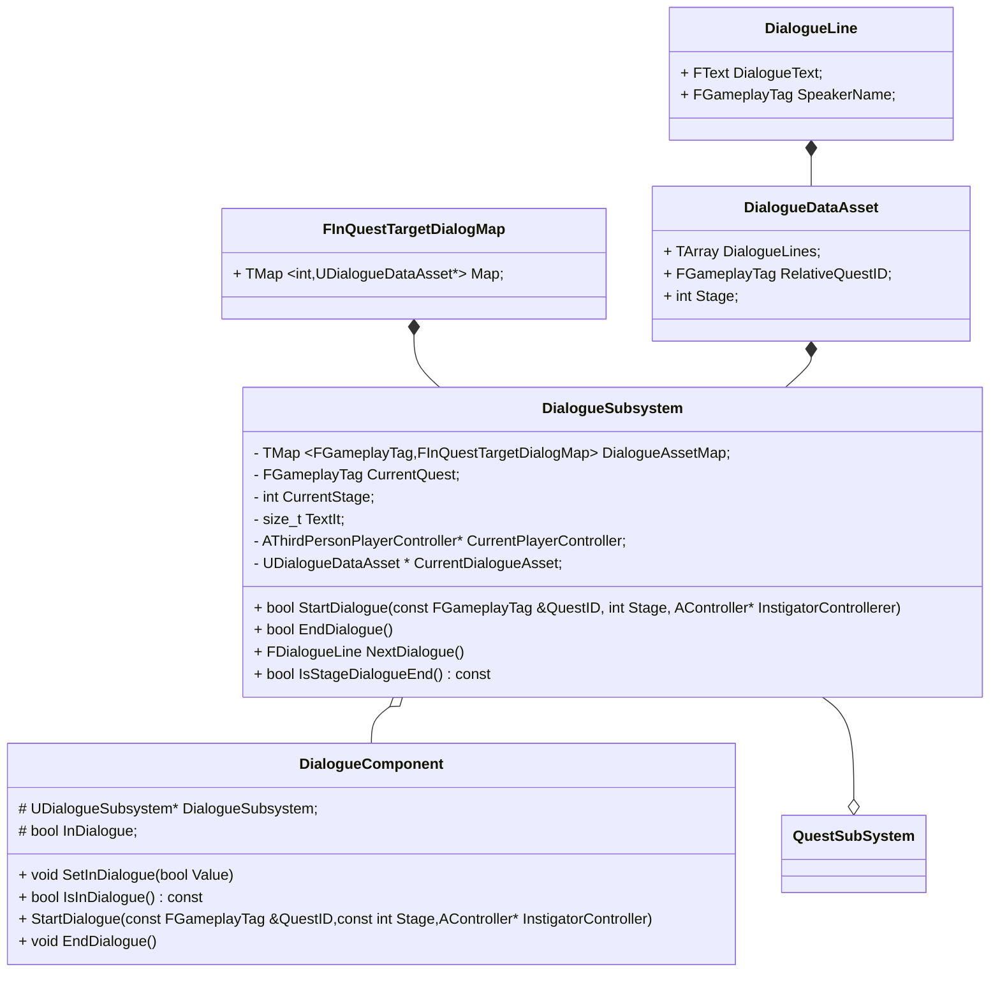
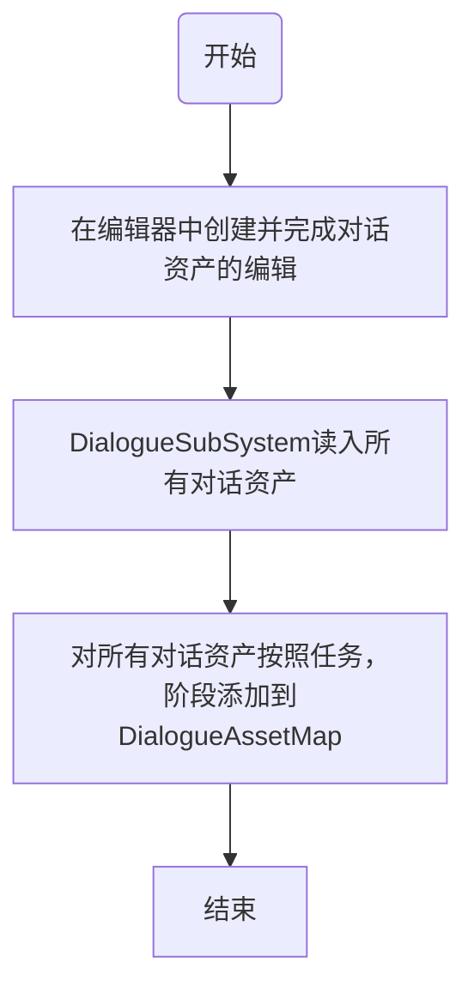
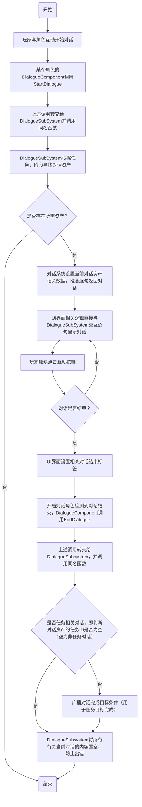

# 对话系统

## 一、类图

解释如下：

1. 真正的数据驱动实现在对话资产里面，编辑器里面也是操作对话资产
2. 对话组件本身是对对话子系统的封装，为了让单个角色对话启动时逻辑更清晰。
3. 对话组件不能有下一句这个功能，因为对话系统本身是集中式的设计，下一句的Speaker不定是组件的Owner，他获取了属于其他人的对话逻辑上不正确。
4. 任务子系统唯一的耦合点在于广播对话完成这一任务目标完成条件

## 二、对话系统初始化以及对话资产读取入流程

## 三、对话进行流程

## 四、如何添加和编辑一个对话资产？并让其在任务中生效？

### 4.1  创建对话资产

1. 去到`Content\Dialogue\Asset`目录下，右键`其他->数据资产->DialogueDataAsset`，建议的命名格式：`QuestNameStage_DialogueName`

2. 打开创建好的数据资产，界面如下：

3. 在`DialogueLine`中可以添加对话，每个对话都要选择`Speaker`并且添加对话内容。
4. 选择`RelatiiveQuestTag`以及`Stage`，前者是对话所属的任务，后者是对话在任务内的哪个阶段，若`RelativeQuestTag`为空，那就是日常对话，`Stage`不管填什么都不生效。

### 4.2 关联到相应NPC

其实能够进行对话的一定是一个`QuestGiver`,所以你只需要到对应角色实例里面，设置`Currnent Focused Quest ID`，告诉他当玩家和他对话时该说哪个任务相关的对话就好，具体哪个阶段不是NPC决定而是玩家任务进度决定的。如果这个变量为空，会进行日常对话。

