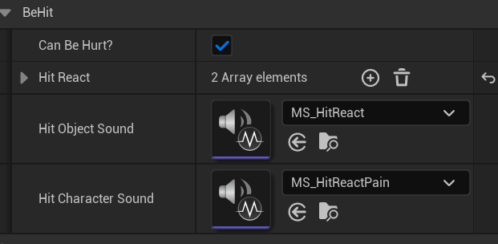
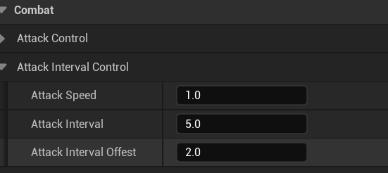
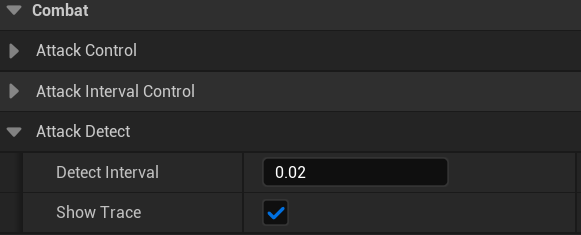
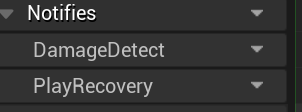
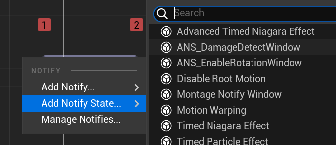
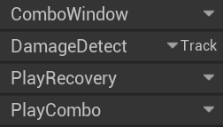
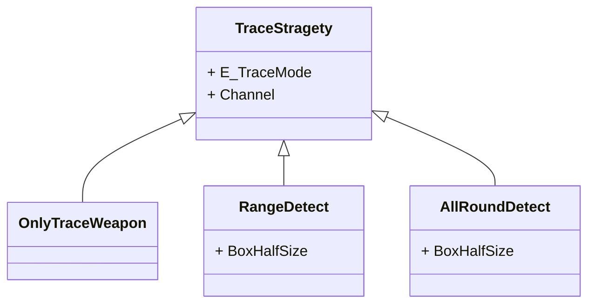

# 战斗系统

## 一、`BPC_Combat`

`NPC Combat`负责管理NPC的战斗和受击，当然，受击会涉及到扣血逻辑，攻击将来也可能会涉及到体力消耗，所以`NPC Combat`是和`Character Status`存在依赖的，但是我用接口进行了解耦，这里不对这点详细赘述，因为用户角度不需要关心这个。

​	与`NPC Combat`一个功能十分类似的组件是`Player Combat`二者具有公共父类`BPC_Combat`，主体逻辑都在`BPC_Combat`中实现，两个子类分别对NPC和Player做了一些适配。

​	`Combat`向外暴露的设置有以下两个功能：

​	1. 攻击和受击相关的动画和音效设置。首先要理解攻击模式的这个概念。

​	2. NPC攻击间隔的设置，其实就是攻击欲望的大小。

### 1.1 攻击模式的设置

​	攻击模式是一组带有特定约束的**攻击动画数组**。他有以下两个成员：

1. `AttackActions`：一个带有攻击检测数据的攻击动画数组，这一组动画作为一个攻击模式，也就是连招，设置好之后，`NPC Combat`在用到这个攻击模式会自动播放连招。数组元素类型为**`BP_AttackWithDetect`**。具体的详细介绍见**二、攻击检测**。
2. `MaxComboNum`：你最多想要播放多少段连招，也就是`Montages`可以播放到第几个元素（从1开始计数，比如播放完数组的1号元素结束，那就是播放两个动画，`MaxComboNum = 2`），主要用来控制难度以及方便拓展连招。

​	`NPC Combat`向外暴露了一个攻击模式数组，他每次攻击会从中随机挑选一个攻击模式进行播放，你设置这个数组即可播放自己的连招，连招的播放都已经写好了逻辑，你只需要在动画中设置相关通知并提供攻击范围检测函数即可，具体看3.5如何新建一个攻击动画适配到`NPC Combat`。

### 1.2 受击动画以及音效的设置

如下：



1. `Can Be Hurt?`本质是无敌标识，不勾选时角色无法被攻击。
2. `Hit React`里面是受击动画，这个数组可以添加任意多元素，当角色受击时随机挑选一个受击动画播放。
3. `Hit Object Sound`是受击时打中物品的声音，也就是打中盔甲之类的声音。
4. `Hit Character Sound`是角色挨打时发出的人叫声。

如果你没有的话可以留空，因为`NPC Combat`自己会进行有效性检测，不会报错。

### 1.3 攻击间隔的设置

攻击间隔也就是攻击欲望的相关设置参数如下：



1. `Attack Speed`：攻击动画的播放速度，你可以在不修改动画的情况下加速或者减慢攻击
2. `Attck Interval`：每一段攻击模式播放完之后过多久才能再次攻击，NPC的话其实就是攻击欲望，玩家的话你设置为0即可，否则攻击输入会被卡住。
3. `Attack Interval Offset`：在前者基础上的时间偏移，如上图所示的设置，就是在一次攻击模式结束后[3,7]秒后可再次攻击。

### 1.4 攻击检测的设置

攻击检测如何检测，也就是检测方式不是这一节的主要内容，想了解这部分请到**二、攻击检测**。这一节主要集中于对已经确定的攻击检测方式进行检测间隔等微调。相关设置参数如下：



1. `Detect Interval`：在检测窗口内多少秒进行一次检测，一般你保持默认值即可。
2. `Show Trace`：是否显示攻击检测轨迹，用于调试。

### 1.5 如何新建一个攻击动画适配到`NPC Combat`

导入你自己的攻击动画，适配到UE5骨骼，然后创建对应montage这里我就不说了，重点在之后如何添加和组织动画通知上面。设置完动画通知之后，还要提供与之对应的攻击检测函数

#### 1.5.1 设置单段攻击动画

所谓单段攻击动画是指你这个攻击模式里面只有一个攻击动画，没有播放连招的情况下。

1. 在通知下创建并重命名以下三个轨道：

   

   第一个轨道用来放攻击检测窗口，第二个轨道用来确定什么时候攻击结束进入后摇。

2. 在`DamageDetect`轨道添加如下通知窗口：

   

   长度就拉到你想要检测攻击的间隔即可。

3. 在`PlayRecovery`轨道添加通知`AN_ComboCanCancel`，注意攻击动作是在这个通知结束的，也就是`ActionManager`是在这个通知被调用`EndAction`的，所以如果不添加这个通知，你的攻击动作无法逻辑结束。

   在这个动作之后的动画部分就属于攻击后摇部分，是优先级最低的一种，类似收刀动作，可以被任何动作打断。

#### 1.5.2 设置连招攻击动画

1. 对于每一个连招中的动画，都必须添加如下四个通知轨道：

   

   其中第二个和第三个与单段动画一样，我只说`ComboWindow`与`PlayCombo`

2. `ComboWindow`上面你需要添加两个通知，类型分别为：`AN_BeginComboWindow`和`AN_EndComboWindow`，就如同名字一样，如果在这两个通知之间有了再一次攻击输入，才会播放下一段连招

3. `PlayrCombo`轨道上面你需要添加`AN_PlayCombo`，这个通知会真正在有了再一次攻击输入时播放连招，也就是从这个通知这里当前动画会被打断进入下一段连招动画。

**注意，连招最后一段动画你千万不要设置`PlayCombo`通知，会引起各自奇怪的逻辑问题！**

#### 1.5.3 通知设置的时序问题

无论是从单纯的逻辑还是从代码实践的角度来讲，上述五个通知一定要有确定的先后顺序，否则会崩。但是说到底其实没有一个非常严格的先后，只是有几个约束必须遵守：

1. `EndComboWindow`必须在`OpenComboWindow`之后。
2. `PlayCombo`必须在`OpenComboWindow`之后，这是因为只有在Combo Window有了攻击输入才会播放连招，否则你的`PlayCombo`会被永远锁住不能跑。
3. `PlayCombo`必须等`DamageDetectWindow`之后一段时间在添加，因为你在攻击检测窗口之前就播放了下一段连招的话，这一段攻击动画的攻击检测就不会进行。
4. `ComboCanCancel`必须在所有通知之后。

## 二、攻击检测

攻击检测本身是和具体的攻击动画密不可分的，不同的动画必须采取不同的检测策略，所以有了类型`BP_AttackWithDetect`，里面可以组合多种检测策略，如果预设的攻击检测方式无法满足你，你也可以自己定于`TraceStragety`数据资产。

### 2.1 `AttackWithDetect`

这个类本质是一个数据资产，包括以下成员：

1. `AttackMontage`：攻击动画的`Montage`。
2. `TraceSetting`：一个`BP_TraceStragety`的数组，下一节我会介绍这个类型，他本质就是用来描述攻击检测方式的数据资产，因为你可能在一个攻击动画里面想用多种攻击检测方式的组合，所以是一个数组。
3. `SoloDamage`：这个动画是否能伤害到一个敌人，比如处决，明显就是这种不可范围攻击的类型。

你创建出这种资产便可以在1.1节中`AttackMode`里面添加，一般一个攻击动画对应一个资产。

### 2.2 `TraceStragety`

类图如下:




`TraceStragety`本身是抽象类，他的两个成员：

1. `E_TraceMode`作为指明数据资产实际检测方式的枚举，主要用于辅助多态辨识，出于解耦考虑以及调试出输出。
2. `Channel`：你要检测哪个Channel，默认就是`Damageable`，所以你没有特殊需求就不要改变。

剩下的三个子类功能分别是:

1. `OnlyTraceWeapon`：跟随武器检测，需要配合`BPI_AttackDetect`使用，2.3节对此有详细介绍，它生成一个球形Trace（胶囊体状）。
2. `RangeDetect`：在玩家面前生成一个指定大小的盒体检测，中心点在玩家前方。
3. `AllRoundDetect`：以玩家为中心生成一个指定大小的盒体检测，盒体中心就是玩家世界坐标中心。

### 2.3 `OnlyTraceWeapon`的适配问题

正如同上一小节所说，`OnlyTraceWeapon`是跟随武器检测的检测方式，所以你如果在1.1节攻击模式的设置中添加了使用这种检测方式的`AttackWithDetect`，你需要在`Combat`组件所在的角色实现`BPI_AttackDetect`来为检测提供武器的实时位置信息，接口定义如下：

```c++
FVector GetWeaponRangeStart();
FVector GetWeaponRangeEnd();
FVector GetRadius();
```

都是一看上去就知道干嘛的，就不多说了。

### 2.4 现阶段提供的具体检测资产

目前提供了以下三个检测资产：

1. `DefaultDetect`：`OnlyTraceWeapon`的实例化，默认包含在每一个`AttackWithDetect`的`TraceSetting`中。
2. `ThrustDetect`：冲刺检测，在玩家前方生成一个3米长的box
3. `FrontCharactrSamllRange`：在玩家前方生成一个2\*2\*2的box

你如果还需要其他资产，自行创建对应数据资产即可。


## 三、如何添加一个新的BPC_Combat

​	这个组件的添加之后是需要实现一些接口才能正常工作的，接下来我每一个小结都会介绍一个必须实现的接口。

### 3.1 `BPI_AttackDetect`

此接口用于确定`OnlyTraceWeapon`(见2.2`TraceStragety`)的检测范围，函数如下：

1. `GetWeaponRangeStart`：武器攻击范围起始位置
2. `GetWeaponRangeEnd`: 武器攻击范围结束位置
3. `Radius`：球形检测半径

### 3.2 `BPI_EndJumping`

此接口用于在受击时结束跳跃相关参数设置，函数如下：

`EndJumpuing`：如名所示。


