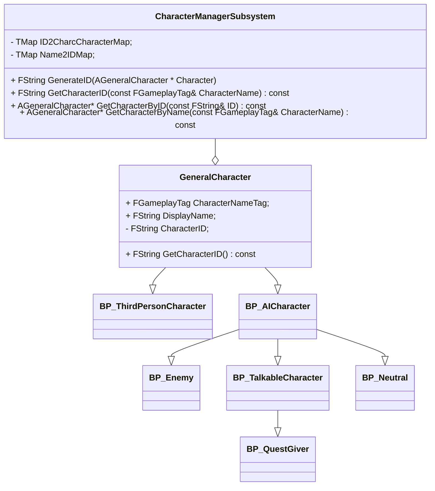
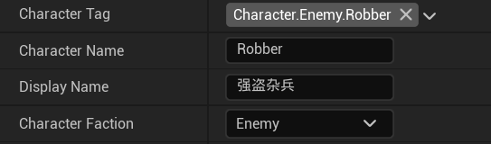

# 角色系统

##  一、抽象角色类与角色管理系统

### 1.1 类图

角色管理系统和角色继承逻辑的基本类图如下，下方所有角色类都是抽象类，不能创建实例：

做一些简单的说明：

1. 所有角色类继承自`GeneralCharacter`，这里有ID和名字以及显示名字这些基本属性，用于角色管理系统的管理和查询
2. 有关任务系统在角色中的实现，对于玩家是直接在玩家控制器实现的，对于NPC是通过在角色实例中添加任务组件`QuestComponent`来实现的，具体任务系统的文档里面会细说，这个组件里面的`SendTargetFinish`实际上是对任务子系统`BroadCastFinish`的封装，用于当条件触发时对NPC所有相关任务进行完成广播，推进玩家进度。

### 1.2 各类型功能简介

我简要说明一下各个角色类的功能和设计目的，如果有特别的类需要详细说明，我会事后更新单开一节讲他。

|       **角色类**       |                         **相关功能**                         |
| :--------------------: | :----------------------------------------------------------: |
|   `GeneralCharacter`   |           抽象基类，用于角色管理系统的角色基本信息           |
| `ThridPersonCharacter` |           玩家角色，一切和玩家角色相关的功能都在此           |
|     `AICharacter`      |                   包含死亡，攻击，以及受击                   |
|        `Enemy`         | 一般的敌人抽象类，Controller为`AIEnemyController`，有独立的行为树，能够巡逻，看见玩家，追逐攻击 |
|       `Netrual`        | 一般的中立方，与`Enemy`不同在于控制器和行为树不同，它只有当玩家打了它才会攻击玩家 |
|  `TalkableCharacter`   |         可交谈角色，相对于`AICharacter`多了谈话组件          |
|      `QuestGiver`      |                         任务相关角色                         |

### 1.3 各角色类型包含类型组件以及组件功能介绍

这里只会对各个角色类型包含组件以及组件功能进行大致介绍，帮助你理解这些设计的逻辑，具体的组件用法需要到**角色组件**这一文档查看。

1. `AICharacter`包含以下组件：
   - `CharacterStatus`：管理角色体力，生命，经验，等级
   - `ActionManager`：动作优先级管理，这是角色动画以及动作转化的核心逻辑
   - `Comabat`：角色受击，攻击，连招都在这里。

2. `Enemy`，`Netrual`并没有新加组件。
3. `TalkeCharacter`新增了如下组件：
   - `Dialogue`：对话组件，封装了对话系统的调用接口，用于启动和播放对话。
4. `QuestGiver`新增了任务组件。

## 二、角色具体类

目前的角色具体类有：

|   具体类   | 抽象父类  |
| :--------: | :-------: |
|  `Robber`  |  `Enemy`  |
| `Elephone` | `Neutral` |

目前这些具体类都没有需要特别注意的功能，我就先不说了。

## 三、如何创建一个新的具体角色类

首先你要做的就是确定你的角色到底和玩家什么关系，然后选择对应的父类

### 3.1  用于角色管理系统的基本设置

打开你创建的角色蓝图，搜索如下字段：

这四个字段是用于角色管理，信息显示以及对话和任务系统查找角色用的，必须设置，我一一解释一下：

1. `Character Tag`：这是角色“种族”名，也是任务系统用于确定角色的名字。如果你是杂兵，比如强盗，任务是击杀三个强盗，那么所有`Character.Enmey.Robber`被杀都会被算入；

   但是如果你想要让任务系统确定某一个特定的NPC，可以去`Content\QuestionSystem\DB_GameplayTag`之下添加新的唯一的Tag，然后设置到你的角色里面以供任务系统识别。

2. `Character Name`：程序内部使用的角色名字，实际上目前除了调试输出没有用到它的地方，因为都被`CharacterTag`字段代替了，但是为了和旧的程序兼容以及防止未来不时之需我还是保留了，毕竟`CharacterTag`只是作为一个“种族名”，具体是哪个个体还是得看名字。这个字段**相同种族的不重要NPC**需要填写成**同一个名字**，角色系统会**自动递增后缀**，如：Robber0,Robber1等。

3. `Display Name`：在游戏中的显示名字。

4. `Character Faction`：角色的阵营划分，例如`Enemy`继承下来的类型就是Enemy阵营，这关系到伤害判断逻辑，因为我默认没有友军伤害，你如果没有特殊需求不要随便乱改这个部分，按照父类的来就好。

### 3.2 相关组件的设置

这部分我不详细说如何设置，只是说要做什么，如何设置在**角色组件**文件里面有说明。

1. `CharacterStatus`里面设置你的生命值，耐力值，如果不是那种成长类型角色而是一般杂兵和固定NPC没必要设置等级。

2. `Combat`里面设置受击动画，受击音效，挨打的叫声，攻击模式，有关攻击模式，其实就是一组攻击动画的组合，就像你连招肯定不止一个动画，具体的说明还是到角色组件里面查看。

3. `Quest`组件负责任务相关设置。
4. `Dialogue`组件你不需要操心设置，只需要关心使用即可。

