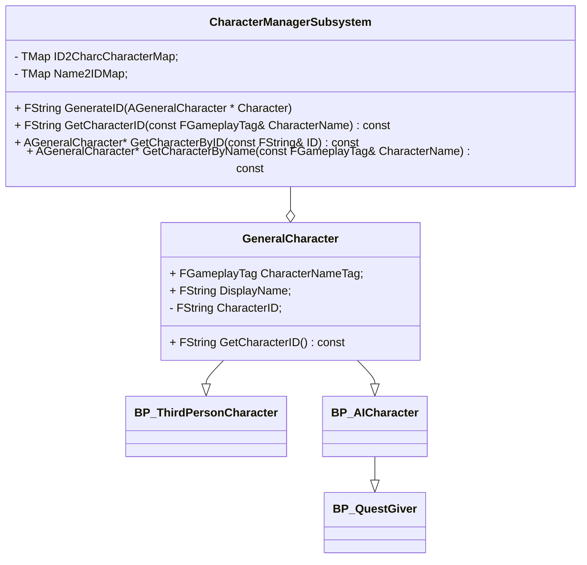
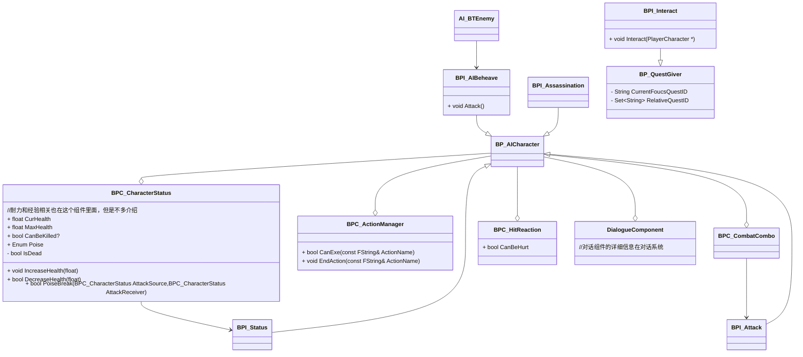
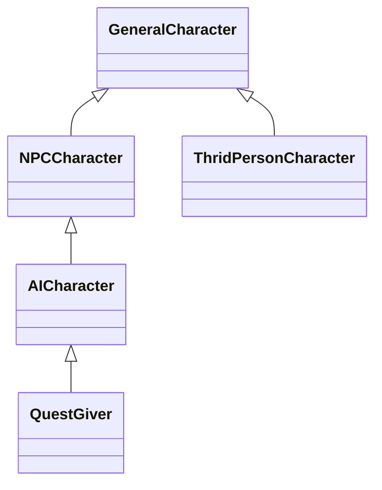

# 角色系统

## 一、类图

角色管理系统和角色继承逻辑的基本类图如下：

NPC的角色功能设计如下：

做一些简单的说明：

1. 所有角色类继承自`GeneralCharacter`，这里有ID和名字以及显示名字这些基本属性，用于角色管理系统的管理和查询
2. 有关任务系统在角色中的实现，对于玩家是直接在玩家控制器实现的，对于NPC是通过在角色实例中添加任务组件`QuestComponent`来实现的，具体任务系统的文档里面会细说，这个组件里面的`SendTargetFinish`实际上是对任务子系统`BroadCastFinish`的封装，用于当条件触发时对NPC所有相关任务进行完成广播，推进玩家进度。
3. `AICharacter`是NPC角色实际基类，血条，暗杀，攻击都在这里面。`QuestGiver`是一个特殊的能发放任务的友方NPC。
6. `ThridPersonCharacter`就是和`AICharacter`类似，是玩家角色的基类里面有特别多的组件和功能，但是这里不多说了。

## 二、角色类继承链条及其功能解析

严格来说，第二节的内容第一节就已经包含，但是因为第一节主要追求全面，类图杂乱，不宜抽取出实际的角色继承链，而这部分又对理解整个设计至关重要，所以我要专门开一节说。

继承链单独的类图如下：

各部分实现的功能：

|       **角色类**       |                         **相关功能**                         |
| :--------------------: | :----------------------------------------------------------: |
|   `GeneralCharacter`   |           抽象基类，用于角色管理系统的角色基本信息           |
| `ThridPersonCharacter` |           玩家角色，一切和玩家角色相关的功能都在此           |
|     `AICharacter`      | 真正第一个非抽象的NPC类，包含血条，攻击，以及自己的AI行为逻辑 |
|      `QuestGiver`      |                  作为可对话的友方NPC而存在                   |

