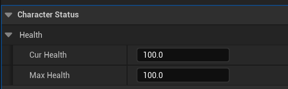
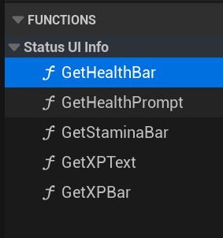
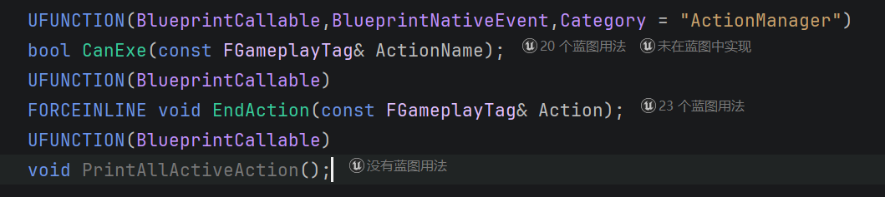
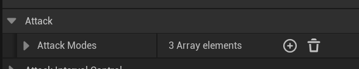

# 角色组件

## 一、`Character Status`

​	这个组件的基本功能是管理角色的生命，体力/耐力，经验，等级等信息，对应的UI界面也在这里更新，但是组件本身不提供UI界面的对象，需要Character自己创建后把引用传递给组件，`AICharacter`已经有了这个UI对象，所以如果是创建新的角色不需要考虑这点，除非你需要创建一些不同于其他角色的UI，1.2节有详细的UI相关介绍。

### 1.1 进行基本状态设置

目前的状态设置对外开放的只有最大和当前生命值，到`Character Status`组件细节面板搜索`Character Status`标签，如下：



进行设置即可。

### 1.2 状态UI相关的设置

一个角色类如果想利用`Character Status`组件进行UI同步更新，需要实现`BPI_Status`接口。接口定义如下：



总的来说就是把提示文本和进度条交给`Character Status`即可，如果你没有某一个的话就不实现对应函数即可，`Character Status`自己会进行有效性检测，无效对象不会更新也不会报错。

但是需要注意，`Character Status`真的只负责更新进度条和提示文本，你的UI放在角色脑袋上还是屏幕空间，这些要由角色自己决定，因为不同角色需求不同。对于`AICharacter`的`Status Widget`，它默认放在角色头顶，只显示血条，如果你需要更改可以去对应蓝图修改。


## 二、`Action Manager`

​	这个组件的目的是进行动作优先级和打断的管理，举个例子：角色在疾奔的时候不能瞄准射箭，角色在挨打的时候不能攻击。

### 2.1 `CanExe`与`End Action`

`Action Manager`向外暴露的主要接口就是两个函数，就如同名字一样，他们的函数签名如下：



第三个函数`PrintAllActiveAction`用来输出当前所有正在进行的动作，主要用于调试，和功能实现无关。

`CanExe`和`EndAction`的输入都为一个Tag，这个Tag在`Character.Action`层级之下，你可以选择对应的Tag，如果要**新增Tag**，**2.2节**有详细介绍。

`CanExe`返回的是当前动作能否执行，并且会把动作加入进行动作集合，当前动作只有能够打断所有进行动作才能执行，蹲下的时候不能疾奔，走路的时候能疾奔，那么蹲下走路时就不能疾奔。实际运用是你需要在`CanExe`后面跟一个`Branch`节点判断，动作不能执行不要播放相关动画或者转化动画蓝图的状态。

每一个动作结束之后，必须调用`End Action`节点把它从进行动作集合中移除，否则这个动作永远不会移除，如果是攻击这种高优先级动作在动画播放完之后没有移除，那么几乎所有的角色动画行为都会被卡住。

我提供的抽象角色父类已经设置好了大部分通用行为，例如：移动，死亡，攻击，受击。你如果有需要，可以根据自己的需求新增，但是必须遵循`CanExe`和`EndAction`的配套使用。

### 2.2 新增动作Tag

你如果要新增动作Tag，有以下两步操作：

1. 到`Content\ThridPerson\BluePrints\ActionInterruptAndPoiseSystem`之下，打开`DB_CharacterActionTag`，新加入你要添加的动作Tag，注意命名格式统一为`Character.Action.***`
2. 同一目录下打开`DB_ActionInterruptTable`设置哪些动作能够打断你新添加的动作：
   - 创建新行，行名字就是你的`***`动作。
   - 设置该行`ActionTag`为你第一步添加的Tag
   - `CanBeInterrput`数组为可以打断你这个动作的动作Tag集合，你添加对应Tag即可


## 三、`NPC Combat`

​	`NPC Combat`负责管理NPC的战斗和受击，当然，受击会涉及到扣血逻辑，攻击将来也可能会涉及到体力消耗，所以`NPC Combat`是和`Character Status`存在依赖的，但是我用接口进行了解耦，这里不对这点详细赘述，因为用户角度不需要关心这个。

​	与`NPC Combat`一个功能十分类似的组件是`Player Combat`二者实现的函数有很多相同的地方，但是并没有公共父类，主要是因为玩家角色的攻击和受击相比一个NPC来说复杂太多了，所以创建了两个组件。

​	`NPC Combat`向外暴露的设置有以下两个功能：

​	1. 攻击和受击相关的动画和音效设置。首先要理解攻击模式的这个概念。

​	2. NPC攻击间隔的设置，其实就是攻击欲望的大小。

### 3.1 攻击模式的设置

​	攻击模式是一组带有特定约束的**攻击动画数组**。他有以下两个成员：

1. `Montages`：一组攻击动画的蒙太奇，这一组动画作为一个攻击模式，也就是连招，设置好之后，`NPC Combat`在用到这个攻击模式会自动播放连招。
2. `MaxComboNum`：你最多想要播放多少段连招，也就是`Montages`可以播放到第几个元素（从1开始计数，比如播放完数组的1号元素结束，那就是播放两个动画，`MaxComboNum = 2`），主要用来控制难度以及方便拓展连招。

​	`NPC Combat`向外暴露了一个攻击模式数组，他每次攻击会从中随机挑选一个攻击模式进行播放，你设置这个数组即可播放自己的连招，连招的播放都已经写好了逻辑，你只需要在动画中设置相关通知并提供攻击范围检测函数即可，具体看3.3如何新建一个攻击动画适配到`NPC Combat`

具体在组件中的标签层级如下：



### 3.2 受击动画以及音效的设置

如下：


1. `Can Be Hurt?`本质是无敌标识，不勾选时角色无法被攻击。
2. `Hit React`里面是受击动画，这个数组可以添加任意多元素，当角色受击时随机挑选一个受击动画播放。
3. `Hit Object Sound`是受击时打中物品的声音，也就是打中盔甲之类的声音。
4. `Hit Character Sound`是角色挨打时发出的人叫声。

如果你没有的话可以留空，因为`NPC Combat`自己会进行有效性检测，不会报错。

### 3.3 如何新建一个攻击动画适配到`NPC Combat`

导入你自己的攻击动画，适配到UE5骨骼，然后创建对应montage这里我就不说了，重点在之后如何添加和组织动画通知上面。设置完动画通知之后，还要提供与之对应的攻击检测函数

#### 3.3.1 设置单段攻击动画

所谓单段攻击动画是指你这个攻击模式里面只有一个攻击动画，没有播放连招的情况下。

1. 在通知下创建并重命名以下两个轨道：

   

   第一个轨道用来放攻击检测窗口，第二个轨道用来确定什么时候攻击结束进入后摇。

2. 在`DamageDetect`轨道添加如下通知窗口：

   

   长度就拉到你想要检测攻击的间隔即可。

3. 在`PlayRecovery`轨道添加通知`AN_ComboCanCancel`，注意攻击动作是在这个通知结束的，也就是`ActionManager`是在这个通知被调用`EndAction`的，所以如果不添加这个通知，你的攻击动作无法逻辑结束。

   在这个动作之后的动画部分就属于攻击后摇部分，是优先级最低的一种，类似收刀动作，可以被任何动作打断。

#### 3.3.2 设置连招攻击动画

1. 对于每一个连招中的动画，都必须添加如下四个通知轨道：

   

   其中第二个和第三个与单段动画一样，我只说`ComboWindow`与`PlayCombo`

2. `ComboWindow`上面你需要添加两个通知，类型分别为：`AN_BeginComboWindow`和`AN_EndComboWindow`，就如同名字一样，如果在这两个通知之间有了再一次攻击输入，才会播放下一段连招

3. `PlayrCombo`轨道上面你需要添加`AN_PlayCombo`，这个通知会真正在有了再一次攻击输入时播放连招，也就是从这个通知这里当前动画会被打断进入下一段连招动画。


## 四、`Quest`

任务组件详情到：任务系统 3.4 关于`QuestComponent`的说明去查看。

## 五、`Dialogue`

对话组件本质是对对话系统调用接口的封装，不过你最好不要随便绕过对话组件去调用对话系统，因为我不保证这个操作的安全性，对话系统有兴趣可查看相关文档，也在同一目录下，这一章之说对话组件对外暴露的接口和用法。

对话组件不需要进行任何额外设置，也没有留给你设置的余地，它的功能就是播放对话。接口如下：

```c++
//查看角色是否在对话中
UFUNCTION(BlueprintCallable,BlueprintPure, Category = "Dialogue")
inline bool IsInDialogue() const;
//根据任务以及节点播放对话
UFUNCTION(BlueprintCallable, Category = "Dialogue")
bool StartDialogue(const FGameplayTag &QuestTag,const int Stage,AThirdPersonPlayerController* PlayerController);
//结束当前对话
UFUNCTION(BlueprintCallable, Category = "Dialogue")
void EndDialogue();
```

就具体实现来讲，对话组件的使用其实和对话窗口紧密耦合的，对话组件负责告诉对话窗口要播放哪个对话，对话窗口的`Play Dialogue`来一步步播放下一个对话。但是这个你不需要操心，只需要设置好`Quest`组件里面的`Focused Quest Tag`即可，因为对话组件会根据角色的聚焦来确定播放哪段对话，具体任务进度不是NPC设置的而是从玩家控制器读取的。详情见任务系统的文档。


